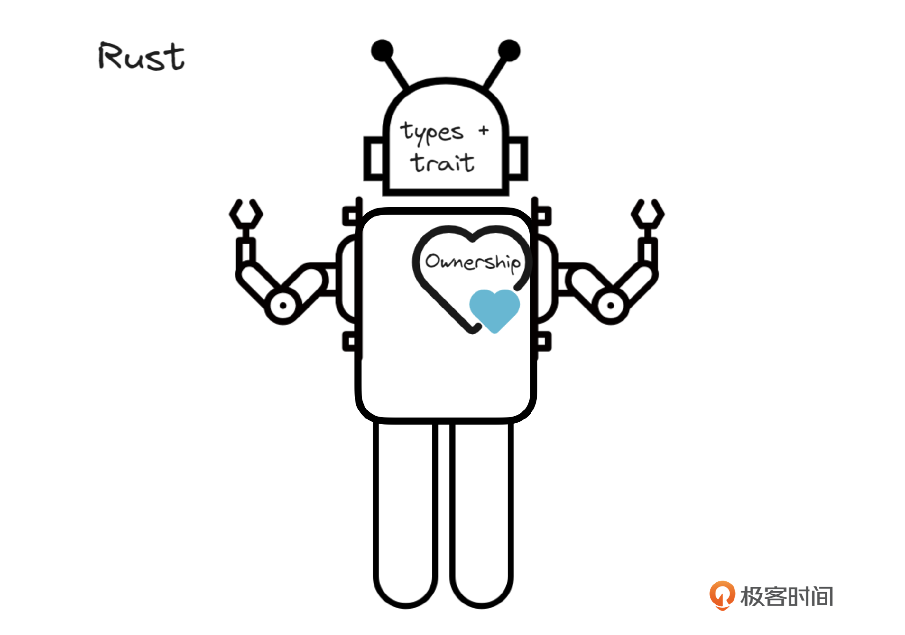
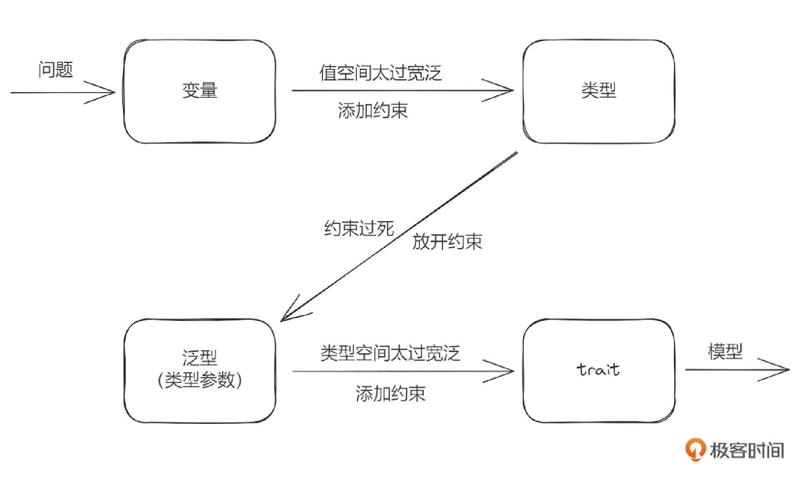
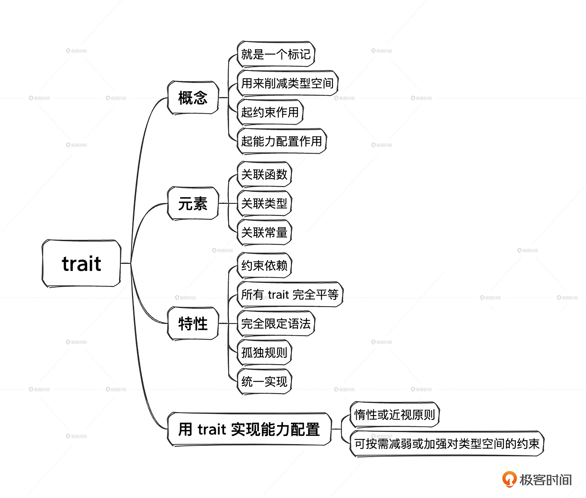

# 09 ｜初识 trait：协议约束与能力配置

你好，我是 Mike。今天我们来一起学习 trait。

trait 在 Rust 中非常重要。如果说所有权是 Rust 中的九阳神功（内功护体），那么类型系统（types + trait）就是 Rust 中的降龙十八掌，学好了便如摧枯拉朽般解决问题。另外一方面，如果把 Rust 比作一个 AI 人的话，那么所有权相当于 Rust 的心脏，类型 + trait 相当于这个 AI 人的大脑。



好了，我就不卖关子了。前面我们已经学习了所有权，现在我们来了解一下这个 trait 到底是什么。

注：所有权是这门课程的主线，会一直贯穿到最后。

## trait 是什么？

trait 用中文来讲就是特征，但是我倾向于不翻译。因为 trait 本身很简单，它就是一个标记（marker 或 tag）而已。比如 `trait TraitA {}` 就定义了一个 trait，TraitA。

只不过这个标记被用在特定的地方，也就是类型参数的后面，用来限定（bound）这个类型参数可能的类型范围。所以 trait 往往是跟类型参数结合起来使用的。比如 `T: TraitA` 就是使用 TraitA 对类型参数 T 进行限制。

这么讲起来比较抽象，我们下面举例说明。

### trait 是一种约束

我们先回忆一下 [第 7 讲](https://time.geekbang.org/column/article/722240) 的一个例子。

```rust
struct Point<T> {
    x: T,
    y: T,
}

fn print<T: std::fmt::Display>(p: Point<T>) {
    println!("Point {}, {}", p.x, p.y);
}

fn main() {
    let p = Point {x: 10, y: 20};
    print(p);

    let p = Point {x: 10.2, y: 20.4};
    print(p);
}
// 输出
Point 10, 20
Point 10.2, 20.4
```

注意代码里的第六行。

```rust
fn print<T: std::fmt::Display>(p: Point<T>) {
```

这里的 Display 就是一个 trait，用来对类型参数 T 进行约束。它表示 **必须要实现了 Display 的类型才能被代入类型参数 T**，也就是限定了 T 可能的类型范围。 `std::fmt::Display` 这个 trait 主要是定义成配合格式化参数 `"{}"` 使用的，和它相对的还有 `std::fmt::Debug`，用来定义成配合格式化参数 `"{:?}"` 使用。而例子里的整数和浮点数，都默认实现了这个 Display trait，因此整数和浮点数这两种类型能够代入函数 print() 的类型参数 T，从而执行打印的功能。

我们看一下如果一个类型没有实现 Display，把它代入 print() 函数，会发生什么。

```rust
struct Point<T> {
    x: T,
    y: T,
}

struct Foo;  // 新定义了一种类型

fn print<T: std::fmt::Display>(p: Point<T>) {
    println!("Point {}, {}", p.x, p.y);
}

fn main() {
    let p = Point {x: 10, y: 20};
    print(p);

    let p = Point {x: 10.2, y: 20.4};
    print(p);

    let p = Point {x: Foo, y: Foo};  // 初始化一个Point<T> 实例
    print(p);
}
```

报编译错误：

```rust
error[E0277]: `Foo` doesn't implement `std::fmt::Display`
  --> src/main.rs:20:11
   |
20 |     print(p);
   |     ----- ^ `Foo` cannot be formatted with the default formatter
   |     |
   |     required by a bound introduced by this call
   |
   = help: the trait `std::fmt::Display` is not implemented for `Foo`
   = note: in format strings you may be able to use `{:?}` (or {:#?} for pretty-print) instead
```

提示说，Foo 类型没有实现 Display，所以没办法编译通过。

回顾一下我们前面 [第 7 讲](https://time.geekbang.org/column/article/722240) 里说到的：类型是对变量值空间的约束。结合 trait 是对类型参数类型空间的约束。我们可以整理出一张图来表达它们之间的关系。



首先，如果我们定义一个变量，这个时候还没有给它指定类型。那么这个时候这个变量的取值空间就是任意的。由于值空间太过宽泛，我们给它指定类型，比如 u32 或字符串，给这个变量的值空间添加了约束。并且指定了明确的类型后， **这个变量的值空间就被限定为仅这一种类型的值空间**。

对于简单的应用，到这一步也够了，但对抽象程度比较高的复杂应用，这种限定就显得太死了。所以又引入了类型参数（泛型）这个机制，用一个类型参数 T 就可以代表不同的类型。这样，以往为一些特定类型开发的函数等，就可以在不改变逻辑的情况下，扩展到支持多种类型，这样就灵活了很多。

但是，只有一个类型参数 T，这个信息还不够，对同一个函数，可能只有少数一些类型适用，而符号 T 本身如果不加任何限制的话，它的内涵（类型空间）就太宽泛了，它可以取任意类型。所以光引入类型参数这个机制还不够，还得配套地引入一个对类型参数进行约束的机制。于是就出现了 trait。结合图片，我们可以明白引入 trait 的原因和 trait 起的作用。

另一方面，从图片里其实也可以看出用 Rust 对问题建模的思维方式。当你在头脑中经过这样一个过程后，针对一个问题在 Rust 中就能建立起对应的模型来，整个过程非常自然。输入问题，输出模型！

语法上， `T: TraitA` 意思就是我们对类型参数 T 施加了 TraitA 这个约束标记。那么，我们怎么给某种具体的类型实现 TraitA，来让那个具体的类型可以代入 T 呢？具体来说，我们要对某个类型 Atype 实现某个 trait 的话，使用语法 `impl TraitA for Atype {}` 就可以做到。

只需要下面三行代码就可以。

```rust
trait TraitA {}

struct Atype;

impl TraitA for Atype {}
```

这三行代码是可以通过编译的，是不是有点吃惊？

对于某个类型 T （这里指的是某种具体的类型）来说，如果它实现了这个 TraitA，我们就说这个类型 **满足约束**。

```rust
T: TraitA
```

一个 trait 在一个类型上只能被实现一次。比如：

```rust
trait TraitA {}

struct Atype;

impl TraitA for Atype {}
impl TraitA for Atype {}
// 输出，编译错误：
error[E0119]: conflicting implementations of trait `TraitA` for type `Atype`
```

例子也很好理解，约束声明一次就够了，多次声明就冲突了，不知道哪一个生效。

### trait 是一种能力配置

如果 trait 仅仅是一个纯标记名称，而不包含内容的话，那它的作用是非常有限的。

```rust
trait TraitA {}
```

下面我们会知道，这个{}里可以放入一些元素，这些元素属于这个 trait。

我们先接着前面那个示例继续讲。

```rust
fn print<T: std::fmt::Display>(p: Point<T>) {
```

Display 对类型参数 T 作了约束，要求将来要代入的具体类型必须实现了 Display 这个 trait。另一方面，也可以说成，Display 给将来要代入到这个类型参数里的具体类型提供了一套“能力”，这套能力是在 Display 这个 trait 中定义和封装的。具体来说，就是能够打印的能力，因为确实有些值是没法打印出来的，比如原始二进制编码，打出来也是乱码。而 Display 就提供了打印的能力，同时还定义了具体的打印要求。

注：Display 是标准库提供的一种常用 trait，我们会在第 11 讲专门讲解标准库里的各种常用 trait。

也就是说， **trait 对类型参数实施约束的同时，也对具体的类型提供了能力**。让我们看到类型参数后面的约束，就知道到时候代入这其中的类型会具有哪些能力。比如我们看到了 Display，就知道那些类型具有打印的能力。我们看到了 PartialEq，就知道那些类型具有比较大小的能力等等。

你也可以这样理解，在 Rust 中 **约束和能力就是一体两面，是同一个东西**。这样下面的写法是不是就好理解多了？

```rust
T: TraitA + TraitB + TraitC + TraitD
```

这个约束表达式，给某种类型 T 提供了从 TraitA 到 TraitD 这 4 套能力。我们后面还会看到，基于多 trait 组合的约束表达式，可以用这种方式提供优美的能力（权限）配置。

那么，一个 trait 里面具体可以有哪些东西呢？

## trait 中包含什么？

trait 里面可以包含关联函数、关联类型和关联常量。

### 关联函数

在 trait 里可以定义关联函数。比如下面 Sport 这个 trait 就定义了四个关联函数。

```rust
trait Sport {
  fn play(&self);     // 注意这里直接以分号结尾，表示函数签名
  fn play_mut(&mut self);
  fn play_own(self);
  fn play_some() -> Self;
}
```

例子里，前 3 个关联函数都带有 Self 参数（⚠️ 所有权三态又出现了），它们被实现到具体类型上的时候，就成为那个具体类型的方法。第 4 个方法， `play_some()` 函数里第一个参数不是 Self 类型，也就是说，它不是 self、&self、&mut self 中的一个，它被实现在具体类型上的时候，就是那个类型的关联函数。

可以看到，在 trait 中可以使用 Rust 语言里的标准类型 Self，用来指代将要被实现这个 trait 的那个类型。使用 impl 语法将一个 trait 实现到目标类型上去。

你可以看一下示例。

```rust
struct Football;

impl Sport for Football {
  fn play(&self) {}    // 注意函数后面的花括号，表示实现
  fn play_mut(&mut self) {}
  fn play_own(self) {}
  fn play_some() -> Self { Self }
}
```

这里这个 Self，就指代 Football 这个类型。

trait 中也可以定义关联函数的默认实现。

比如：

```rust
trait Sport {
  fn play(&self) {}    // 注意这里一对花括号，就是trait的关联函数的默认实现
  fn play_mut(&mut self) {}
  fn play_own(self);   // 注意这里是以分号结尾，就表示没有默认实现
  fn play_some() -> Self;
}
```

在这个示例里， `play()` 和 `play_mut()` 后面定义了函数体，因此实际上提供了默认实现。

有了 trait 关联函数的默认实现后，具体类型在实现这个 trait 的时候，就可以“偷懒”，直接利用默认实现。比如：

```rust
struct Football;

impl Sport for Football {
  fn play_own(self) {}
  fn play_some() -> Self { Self }
}
```

这个跟下面这个例子效果是一样的。

```rust
struct Football;

impl Sport for Football {
  fn play(&self) {}
  fn play_mut(&mut self) {}
  fn play_own(self) {}
  fn play_some() -> Self { Self }
}
```

上面的代码相当于 Football 类型重新实现了一次 `play()` 和 `play_mut()` 函数，覆盖了 trait 的这两个函数的默认实现。

在类型上实现了 trait 后就可以使用这些方法了。

```rust
fn main () {
  let mut f = Football;
  f.play();      // 方法在实例上调用
  f.play_mut();
  f.play_own();
  let _g = Football::play_some();    // 关联函数要在类型上调用
  let _g = <Football as Sport>::play_some();  // 注意这样也是可以的
}
```

### 关联类型

在 trait 中，可以带一个或多个关联类型。关联类型起一种类型占位功能，定义 trait 时声明，再把 trait 实现到类型上的时候为其指定具体的类型。比如：

```rust
pub trait Sport {
    type SportType;

    fn play(&self,  st: Self::SportType);
}

struct Football;
pub enum SportType {
  Land,
  Water,
}

impl Sport for Football {
  type SportType = SportType;  // 这里故意取相同的名字，不同的名字也是可以的
  fn play(&self,  st: Self::SportType){}  // 方法中用到了关联类型
}

fn main() {
  let f = Football;
  f.play(SportType::Land);
}
```

解释一下，我们在给 Football 类型实现 Sport trait 的时候，指明具体的关联类型 SportType 为一个枚举类型，用来区分陆地运动与水上运动。注意看 trait 中的 play 方法的第二个参数，它就是用的关联类型占位。

#### 在 T 上使用关联类型

我们再来看一个示例，标准库中迭代器 Iterator trait 的定义。

```rust
pub trait Iterator {
    type Item;

    fn next(&mut self) -> Option<Self::Item>;
}
```

Iterator 定义了一个关联类型 Item。注意这里的 `Self::Item` 实际是 `<Self as Iterator>::Item` 的简写。一般来说，如果一个类型参数被 TraitA 约束，而 TraitA 里有关联类型 MyType，那么可以用 `T::Mytype` 这种形式来表示路由到这个关联类型。

比如：

```rust
trait TraitA {
  type Mytype;
}

fn doit<T: TraitA>(a: T::Mytype) {}  // 这里在函数中使用了关联类型

struct TypeA;
impl TraitA for TypeA {
  type Mytype = String;  // 具化关联类型为String
}

fn main() {
  doit::<TypeA>("abc".to_string());  // 给Rustc小助手喂信息：T具化为TypeA
}
```

上面示例在 `doit()` 函数中使用了 TraitA 中的关联类型，用的是 `T::Mytype` 这种路由/路径形式。在 `main()` 函数中调用 `doit()` 函数时，手动把类型参数 T 具化为 TypeA。你可以多花一些时间熟悉一下这种表达形式。

#### 在约束中具化关联类型

在指定约束的时候，可以把关联类型具化。你可以看一下我给出的示例。

```rust
trait TraitA {
    type Item;
}
struct Foo<T: TraitA<Item=String>> {  // 这里在约束表达式中对关联类型做了具化
    x: T
}
struct A;
impl TraitA for A {
    type Item = String;
}

fn main() {
    let a = Foo {
        x: A,
    };
}
```

上面的代码在约束表达式中对关联类型做了具化，具化为 String 类型。

```rust
T: TraitA<Item=String>
```

这样表达的意思就是限制必须实现了 TraitA，而且它的关联类型必须是 String 才能代入这个 T。假如我们稍微改一下，把类型 A 实现 TraitA 时的关联类型 Item 具化为 u32，就会编译报错，你可以试着编译一下看下提示。

```rust
trait TraitA {
    type Item;
}
struct Foo<T: TraitA<Item=String>> {
    x: T
}
struct A;
impl TraitA for A {
    type Item = u32;  // 这里类型不匹配
}

fn main() {
    let a = Foo {
        x: A,  // 报错
    };
}
```

慢慢地我们给的示例有些烧脑了，现在你并不需要精通这些用法， **第一步是要认识它们**，当你看到别人写这种代码的时候，能基本看懂就可以了。

#### 对关联类型的约束

在定义关联类型的时候，也可以给关联类型添加约束。意思是后面在具化这个类型的时候，那些类型必须要满足于这些约束，或者说实现过这些约束。你可以看我给出的这个例子。

```rust
use std::fmt::Debug;

trait TraitA {
    type Item: Debug;  // 这里对关联类型添加了Debug约束
}

#[derive(Debug)]       // 这里在类型A上自动derive Debug约束
struct A;

struct B;

impl TraitA for B {
  type Item = A;  // 这里这个类型A已满足Debug约束
}
```

在使用时甚至可以加强对关联类型的约束。比如：

```rust
use std::fmt::Debug;

trait TraitA {
    type Item: Debug;  // 这里对关联类型添加了Debug约束
}

#[derive(Debug)]
struct A;

struct B;

impl TraitA for B {
  type Item = A;  // 这里这个类型A已满足Debug约束
}

fn doit<T>()    // 定义类型参数T
where
    T: TraitA,  // 使用where语句将T的约束表达放在后面来
    T::Item: Debug + PartialEq  // 注意这一句，直接对TraitA的关联类型Item添加了更多一个约束 PartialEq
{
}
```

请注意上面例子里的 `doit()` 函数。我们使用 where 语句把类型参数 T 的约束表达放在后面，同时使用 `T::Item: Debug + PartialEq` 来加强对 TraitA 的关联类型 Item 的约束，表示只有实现过 TraitA 且其关联类型 Item 的具化版必须满足 Debug 和 PartialEq 的约束。

这个例子稍微有点复杂，不过理解后，你会感觉到 Rust trait 的精髓。目前你可以把这个示例当作思维体操来练一练，没事了回来细品一下。另外，你可以自己修改这个例子，看看 Rustc 小助手会告诉你什么。

### 关联常量

同样的，trait 里也可以携带一些常量信息，表示这个 trait 的一些内在信息（挂载在 trait 上的信息）。和关联类型不同的是，关联常量可以在 trait 定义的时候指定，也可以在给具体的类型实现的时候指定。

你可以看一下这个例子。

```rust
trait TraitA {
    const LEN: u32 = 10;
}

struct A;
impl TraitA for A {
    const LEN: u32 = 12;
}

fn main() {
    println!("{:?}",A::LEN);
    println!("{:?}",<A as TraitA>::LEN);
}
//输出
12
12
```

如果在 impl 的时候不指定，会有什么效果呢？你可以看看代码运行后的结果。

```rust
trait TraitA {
    const LEN: u32 = 10;
}

struct A;
impl TraitA for A {}

fn main() {
    println!("{:?}",A::LEN);
    println!("{:?}",<A as TraitA>::LEN);
}
//输出
10
10
```

## trait 作为一种协议

我们已经看到，trait 里有可选的关联函数、关联类型、关联常量这三项内容。一旦 trait 定义好，它就相当于一条法律或协议，在实现它的各个类型之间，在团队协作中不同的开发者之间，都必须按照它定义的规范实施。这是 **强制性** 的，而且这种强制性是由 Rust 编译器来执行的。也就是说， **如果你不想按这套协议来实施，那么你注定无法编译通过。**

这个对于团队开发来说非常重要。它相当于在团队中协调的接口协议，强制不同成员之间达成一致。 **从这个意义上来讲，Rust 非常适合团队开发**。

### Where

当类型参数后面有多个 trait 约束的时候，会显得“头重脚轻”，比较难看，所以 Rust 提供了 Where 语法来解决这个问题。Where 关键字可用来把约束关系统一放在后面表示。

比如这个函数：

```rust
fn doit<T: TraitA + TraitB + TraitC + TraitD + TraitE>(t: T) -> i32 {}
```

这行代码可以写成下面这种形式。

```rust
fn doit<T>(t: T) -> i32
where
    T: TraitA + TraitB + TraitC + TraitD + TraitE
{}
```

这样过多的 trait 约束就不至于太干扰函数签名的视觉完整性。

### 约束依赖

Rust 还提供了一种语法表示约束间的依赖。

```rust
trait TraitA: TraitB {}
```

初看起来，这跟 C++等语言的类的继承有点像。实际不是，差异很大。 **这个语法的意思是如果某种类型要实现 TraitA，那么它也要同时实现 TraitB**。反过来不成立。

例子：

```rust
trait Shape { fn area(&self) -> f64; }
trait Circle : Shape { fn radius(&self) -> f64; }
```

上面这两行代码其实等价于下面这两行代码。

```rust
trait Shape { fn area(&self) -> f64; }
trait Circle where Self: Shape { fn radius(&self) -> f64; }
```

你也可以看一下使用时的约束表示。

```rust
T: Circle
实际上表示：
T: Circle + Shape
```

在这个约束依赖的限定下，如果你对一个类型实现了 Circle trait，却没有实现 Shape，那么 Rust 小助手会提示你这个类型不满足约束 Shape。

比如下面代码：

```rust
trait Shape {}
trait Circle : Shape {}
struct A;
struct B;
impl Shape for A {}
impl Circle for A {}
impl Circle for B {}
```

提示出错：

```rust
error[E0277]: the trait bound `B: Shape` is not satisfied
 --> src/main.rs:7:17
  |
7 | impl Circle for B {}
  |                 ^ the trait `Shape` is not implemented for `B`
  |
  = help: the trait `Shape` is implemented for `A`
note: required by a bound in `Circle`
 --> src/main.rs:2:16
  |
2 | trait Circle : Shape {}
  |                ^^^^^ required by this bound in `Circle`
```

一个 trait 依赖多个 trait 也是可以的。

```rust
trait TraitA: TraitB + TraitC {}
```

这个例子里面， `T: TraitA ` 实际表 `T: TraitA + TraitB + TraitC`。因此可以少写不少代码。

**约束之间是完全平等的，理解这一点非常重要**，通过刚刚的这些例子可以看到约束依赖是消除约束条件冗余的一种方式。

在约束依赖中，冒号后面的叫 supertrait，冒号前面的叫 subtrait。可以理解为 subtrait 在 supertrait 的约束之上，又多了一套新的约束。这些不同约束的地位是平等的。

### 约束中同名方法的访问

有的时候多个约束上会定义同名方法，像下面这样：

```rust
trait Shape {
    fn play(&self) {    // 定义了play()方法
        println!("1");
    }
}
trait Circle : Shape {
    fn play(&self) {    // 也定义了play()方法
        println!("2");
    }
}
struct A;
impl Shape for A {}
impl Circle for A {}

impl A {
    fn play(&self) {    // 又直接在A上实现了play()方法
        println!("3");
    }
}

fn main() {
  let a = A;
  a.play();    // 调用类型A上实现的play()方法
  <A as Circle>::play(&a);  // 调用trait Circle上定义的play()方法
  <A as Shape>::play(&a);   // 调用trait Shape上定义的play()方法
}
//输出
3
2
1
```

上面示例展示了两个不同的 trait 定义同名方法，以及在类型自身上再定义同名方法，然后是如何精准地调用到不同的实现的。可以看到，在 Rust 中，同名方法没有被覆盖，能精准地路由过去。

`<A as Circle>::play(&a);` 这种语法，叫做 **完全限定语法**，是调用类型上某一个方法的完整路径表达。如果 impl 和 impl trait 时有同名方法，用这个语法就可以明确区分出来。

## 用 trait 实现能力配置

### trait 提供了寻找方法的范围

Rust 在一个实例上是怎么检查有没有某个方法的呢？

1. 检查有没有直接在这个类型上实现这个方法。
2. 检查有没有在这个类型上实现某个 trait，trait 中有这个方法。

一个类型可能实现了多个 trait，不同的 trait 中各有一套方法，这些不同的方法中可能还会出现同名方法。Rust 在这里采用了一种惰性的机制，由开发者指定在当前的 mod 或 scope 中使用哪套或哪几套能力。因此，对应地需要开发者手动地将要用到的 trait 引入当前 scope。

比如下面这个例子，我们定义两个隔离的模块，并在 module_b 里引入 module_a 中定义的类型 A。

```rust
mod module_a {
    pub trait Shape {
        fn play(&self) {
            println!("1");
        }
    }

    pub struct A;
    impl Shape for A {}
}

mod module_b {
    use super::module_a::A;  // 这里只引入了另一个模块中的类型

    fn doit() {
        let a = A;
        a.play();
    }
}
```

报错了，怎么办呢？

```rust
error[E0599]: no method named `play` found for struct `A` in the current scope
  --> src/lib.rs:17:11
   |
3  |         fn play(&self) {
   |            ---- the method is available for `A` here
...
8  |     pub struct A;
   |     ------------ method `play` not found for this struct
...
17 |         a.play();
   |           ^^^^ method not found in `A`
   |
   = help: items from traits can only be used if the trait is in scope
help: the following trait is implemented but not in scope; perhaps add a `use` for it:
   |
13 +     use crate::module_a::Shape;
```

引入 trait 就可以了。

```rust
mod module_a {
    pub trait Shape {
        fn play(&self) {
            println!("1");
        }
    }

    pub struct A;
    impl Shape for A {}
}

mod module_b {
    use super::module_a::Shape;  // 引入这个trait
    use super::module_a::A;

    fn doit() {
        let a = A;
        a.play();
    }
}
```

也就是说，在当前 mod 不引入对应的 trait，你就得不到相应的能力。因此 **Rust 的 trait 需要引入当前 scope 才能使用的方式可以看作是能力配置（Capability Configuration）机制。**

### 约束可按需配置

有了 trait 这种能力配置机制，我们可以在需要的地方按需加载能力。需要什么能力就引入什么能力（提供对应的约束）。不需要一次性限制过死，比如下面的示例就演示了几种约束组合的可能性。

```rust
trait TraitA {}
trait TraitB {}
trait TraitC {}

struct A;
struct B;
struct C;

impl TraitA for A {}
impl TraitB for A {}
impl TraitC for A {}  // 对类型A实现了TraitA, TraitB, TraitC
impl TraitB for B {}
impl TraitC for B {}  // 对类型B实现了TraitB, TraitC
impl TraitC for C {}  // 对类型C实现了TraitC

// 7个版本的doit() 函数
fn doit1<T: TraitA + TraitB + TraitC>(t: T) {}
fn doit2<T: TraitA + TraitB>(t: T) {}
fn doit3<T: TraitA + TraitC>(t: T) {}
fn doit4<T: TraitB + TraitC>(t: T) {}
fn doit5<T: TraitA>(t: T) {}
fn doit6<T: TraitB>(t: T) {}
fn doit7<T: TraitC>(t: T) {}

fn main() {
    doit1(A);
    doit2(A);
    doit3(A);
    doit4(A);
    doit5(A);
    doit6(A);
    doit7(A);  // A的实例能用在所有7个函数版本中

    doit4(B);
    doit6(B);
    doit7(B);  // B的实例只能用在3个函数版本中

    doit7(C);  // C的实例只能用在1个函数版本中
}
```

示例里，A 的实例能用在全部的（7 个）函数版本中，B 的实例只能用在 3 个函数版本中，C 的实例只能用在 1 个函数版本中。

我们再来看一个示例，这个示例演示了如何对带类型参数的结构体在实现方法的时候，按需求施加约束。

```rust
use std::fmt::Display;

struct Pair<T> {
    x: T,
    y: T,
}

impl<T> Pair<T> {    // 第一次 impl
    fn new(x: T, y: T) -> Self {
        Self { x, y }
    }
}

impl<T: Display + PartialOrd> Pair<T> {  // 第二次 impl
    fn cmp_display(&self) {
        if self.x >= self.y {
            println!("The largest member is x = {}", self.x);
        } else {
            println!("The largest member is y = {}", self.y);
        }
    }
}
```

这个示例中，我们对类型 `Pair<T>` 做了两次 impl。可以看到，第二次 impl 时，添加了约束 `T: Display + PartialOrd`。

因为我们 cmd_display 方法需要用到打印能力和元素比大小排序的能力，所以对类型参数 T 施加了 Display 和 PartialOrd 两种约束（两种能力）。而对于 new 函数来说，它不需要这些能力，因此 impl 的时候就可以不施加这些约束。我们前面讲过，Rust 中对类型是可以多次 impl 的。

## 关于 trait，你还要了解什么？

### 1.孤儿规则

Rust 的孤儿规则（Orphan Rule）是 Rust 编程语言中一个重要的设计原则，用于确保类型安全和一致性。它限制了在实现 trait 时的灵活性，以避免潜在的冲突和不一致性。以下是关于孤儿规则的详细解释：

---

#### 1. 背景：什么是 Trait 和实现？

在 Rust 中，`trait` 是一种定义共享行为的方式，类似于其他语言中的接口。通过为某个类型实现一个 `trait`，可以为该类型添加特定的行为。

例如：

```rust
trait Speak {  
    fn speak(&self);  
}  
​  
struct Dog;  
​  
impl Speak for Dog {  
    fn speak(&self) {  
        println!("Woof!");  
   }  
}
```

在这个例子中，我们为 `Dog` 类型实现了 `Speak` trait。

---

##### 2. 孤儿规则的定义

孤儿规则的核心是：

> 如果你想为某个类型实现一个 `trait`，那么要么 `trait` 定义在你的 crate 中，要么类型定义在你的 crate 中。

换句话说：

- 如果你在一个 crate 中定义了一个 `trait`，你可以为任何类型实现这个 `trait`。

- 如果你在一个 crate 中定义了一个类型，你可以为这个类型实现任何 `trait`。

- **但你不能为一个外部 crate 中的 `trait` 实现一个外部 crate 中的类型。**

---

##### 3. 为什么需要孤儿规则？

孤儿规则的主要目的是**避免实现冲突**。如果没有孤儿规则，可能会出现以下问题：

###### (1) 多个 crate 提供相同的实现

假设两个不同的 crate 都为同一个外部类型实现了同一个外部 `trait`，那么当这两个 crate 被同时引入到一个项目中时，编译器将无法确定应该使用哪个实现，从而导致冲突。

###### (2) 破坏封装性

如果允许任意 crate 为外部类型实现外部 `trait`，那么外部类型的作者可能无法完全控制其行为。这会破坏封装性和模块化设计的原则。

---

##### 4. 示例：违反孤儿规则的情况

以下是一个违反孤儿规则的例子：

```rust
// 假设这是来自外部 crate 的类型和 trait  
use std::fmt::Display;  
​  
struct ExternalType;  
​  
// 错误：既没有定义 `ExternalType`，也没有定义 `Display`  
impl Display for ExternalType {  
    fn fmt(&self, f: &mut std::fmt::Formatter<'_>) -> std::fmt::Result {  
        write!(f, "This is an external type")  
   }  
}
```

上述代码会报错，因为：

- `Display` 是标准库中的 `trait`。

- `ExternalType` 是一个假设的外部类型。

- 我们既没有定义 `Display`，也没有定义 `ExternalType`，因此违反了孤儿规则。

---

##### 5. 如何绕过孤儿规则？

虽然孤儿规则限制了实现的灵活性，但可以通过以下方法间接实现类似的功能：

###### (1) 使用 Newtype 模式

Newtype 模式是一种常见的解决方法，通过创建一个新的类型来包装外部类型，然后为新类型实现所需的 `trait`。

示例：

```rust
use std::fmt::Display;  
​  
struct ExternalType;  
​  
// 创建一个新的类型来包装 `ExternalType`  
struct Wrapper(ExternalType);  
​  
// 为 `Wrapper` 实现 `Display`  
impl Display for Wrapper {  
    fn fmt(&self, f: &mut std::fmt::Formatter<'_>) -> std::fmt::Result {  
        write!(f, "This is a wrapped external type")  
   }  
}
```

这样，我们就遵守了孤儿规则，因为 `Wrapper` 是我们定义的新类型。

###### (2) 使用特征对象或泛型

在某些情况下，可以通过特征对象（Trait Objects）或泛型来避免直接实现 `trait`。

---

##### 6. 总结

孤儿规则是 Rust 中一项重要的设计原则，旨在防止实现冲突并维护类型系统的完整性。它的核心思想是：

- 你只能为“你拥有”的 `trait` 或类型实现行为。

- 如果需要为外部类型实现外部 `trait`，可以使用 Newtype 模式等技巧。

通过理解孤儿规则，开发者可以更好地设计模块化的代码，并避免潜在的冲突问题。

#### 2.Blanket Implementation

在 Rust 中，**Blanket Implementation** （覆盖实现）是一种特殊的 `trait` 实现方式，它允许为满足某些条件的所有类型自动实现一个 `trait`。这种方式非常强大，因为它可以为一组类型提供通用的行为，而无需为每个具体类型单独实现。

以下是关于 Blanket Implementation 的详细解释：

---

##### 1. 什么是 Blanket Implementation？

Blanket Implementation 是指通过泛型约束（如 `where` 子句或 trait bounds），为所有满足特定条件的类型实现某个 `trait`。它的核心思想是：**“如果一个类型满足某些要求，那么它就自动拥有这个 `trait` 的行为。”**

例如，Rust 标准库中有一个经典的 Blanket Implementation：

```rust
impl<T: Display> ToString for T {  
    fn to_string(&self) -> String {  
        format!("{}", self)  
   }  
}
```

这段代码的意思是：**任何实现了 `Display` trait 的类型 `T`，都会自动获得 `ToString` trait 的实现** 。也就是说，只要一个类型可以被格式化为字符串（通过 `Display`），它就可以调用 `to_string()` 方法。

---

##### 2. 为什么需要 Blanket Implementation？

Blanket Implementation 的主要目的是：

- **减少重复代码** ：通过一次实现，为所有符合条件的类型提供通用行为。

- **增强灵活性** ：开发者不需要为每个具体类型手动实现 `trait`，只需要确保类型满足约束条件即可。

- **提高一致性** ：通过统一的方式为一组类型提供行为，避免了手动实现可能带来的不一致。

---

##### 3. 示例：如何使用 Blanket Implementation？

###### (1) 标准库中的例子

Rust 标准库中有很多 Blanket Implementation 的例子。以下是一个常见的例子：

```rust
// 为所有实现了 `Iterator` 的类型实现 `IntoIterator`  
impl<I: Iterator> IntoIterator for I {  
    type Item = I::Item;  
    type IntoIter = I;  
    fn into_iter(self) -> Self::IntoIter {  
        self  
   }  
}
```

这段代码的意思是：**任何实现了 `Iterator` 的类型，都可以直接作为 `IntoIterator` 使用** 。这使得我们可以对迭代器类型的对象直接调用 `.into_iter()` 方法。

###### (2) 自定义 Blanket Implementation

我们也可以在自己的代码中定义 Blanket Implementation。例如：

```rust
use std::fmt::Debug;  
​  
// 定义一个简单的 trait  
trait MyTrait {  
    fn describe(&self);  
}  
​  
// 为所有实现了 `Debug` 的类型实现 `MyTrait`  
impl<T: Debug> MyTrait for T {  
    fn describe(&self) {  
        println!("This value is {:?}", self);  
   }  
}  
​  
fn main() {  
    let num = 42;  
    let text = "hello";  
​  
    // 因为 i32 和 &str 都实现了 `Debug`，所以它们自动获得了 `MyTrait` 的实现  
    num.describe();  // 输出: This value is 42  
    text.describe(); // 输出: This value is "hello"  
}
```

在这个例子中：

- 我们为所有实现了 `Debug` 的类型 `T` 提供了一个默认的 `MyTrait` 实现。

- 这样，任何实现了 `Debug` 的类型都可以直接调用 `describe()` 方法。

---

##### 4. Blanket Implementation 的限制

尽管 Blanket Implementation 非常强大，但它也有一些限制和需要注意的地方：

###### (1) 冲突的可能性

如果多个 Blanket Implementation 的约束条件重叠，可能会导致冲突。例如：

```rust
trait A {}  
trait B {}  
​  
impl<T> A for T {}  
impl<T> B for T {}  
​  
// 如果尝试为同时实现 A 和 B 的类型定义新的行为，可能会导致冲突  
impl<T: A + B> ToString for T {  
    fn to_string(&self) -> String {  
        "Conflict".to_string()  
   }  
}
```

这种情况下，编译器可能无法确定应该使用哪个实现。

###### (2) 覆盖具体实现

如果为某个具体类型提供了单独的实现，那么该实现会优先于 Blanket Implementation。例如：

```rust
trait MyTrait {  
    fn describe(&self);  
}  
​  
// Blanket Implementation  
impl<T: Debug> MyTrait for T {  
    fn describe(&self) {  
        println!("This value is {:?}", self);  
   }  
}  
​  
// 具体实现  
impl MyTrait for i32 {  
    fn describe(&self) {  
        println!("This is a special i32: {}", self);  
   }  
}  
​  
fn main() {  
    let num = 42;  
    let text = "hello";  
​  
    num.describe();  // 输出: This is a special i32: 42  
    text.describe(); // 输出: This value is "hello"  
}
```

在这里，`i32` 的具体实现覆盖了 Blanket Implementation。

---

##### 5. 总结

Blanket Implementation 是 Rust 中一种强大的工具，用于为一组类型提供通用的行为。它的核心特点包括：

- **基于泛型约束** ：通过 `where` 子句或 trait bounds，为所有符合条件的类型实现 `trait`。

- **减少重复代码** ：避免为每个具体类型单独实现 `trait`。

- **灵活性和一致性** ：为一组类型提供统一的行为。

然而，在使用 Blanket Implementation 时需要注意潜在的冲突问题，并确保设计清晰、合理。通过理解 Blanket Implementation，开发者可以更高效地利用 Rust 的泛型系统和 trait 系统，编写简洁且可复用的代码。

## 小结

认真学完了这节课的内容之后，你有没有被震撼到？这完全就是一种全新的思维体系，和之前我们熟悉的 OOP 等方式完全不同了。Rust 中 trait 的概念本身非常简单，但用法又极其灵活。

trait 的引入是为了对泛型的类型空间进行约束，进入约束的同时也就提供了能力，约束与能力是一体两面。trait 中可以包含关联函数、关联类型和关联常量。其中关联类型的理解难度较大，但是其模式也就那么固定的几种，多花点时间熟悉一般不会有问题。

trait 定义好后，可以作为代码与代码之间、代码与开发者之间、开发者与开发者之间的强制性法律协议而存在，而这个法律的仲裁者就是 Rustc 编译器。

可以说， **Rust 是一门面向约束编程的语言**。面向约束是 Rust 中非常独特的设计，也是 Rust 的灵魂。简单地把 trait 当作其他语言中的 class 或 interface 去理解使用，是非常有害的。



## 思考题

如果你学习或者了解过 Java、C++等面向对象语言的话，可以聊一聊 trait 的依赖和 OOP 继承的区别在哪里。

欢迎你把思考后的结果分享到评论区，也欢迎你把这节课的内容分享给对 Rust 感兴趣的朋友，我们下节课再见！
