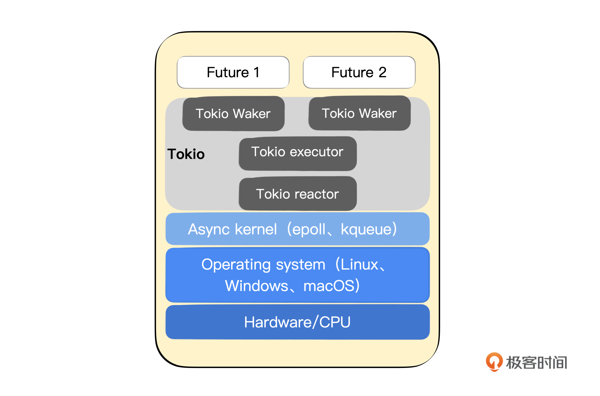
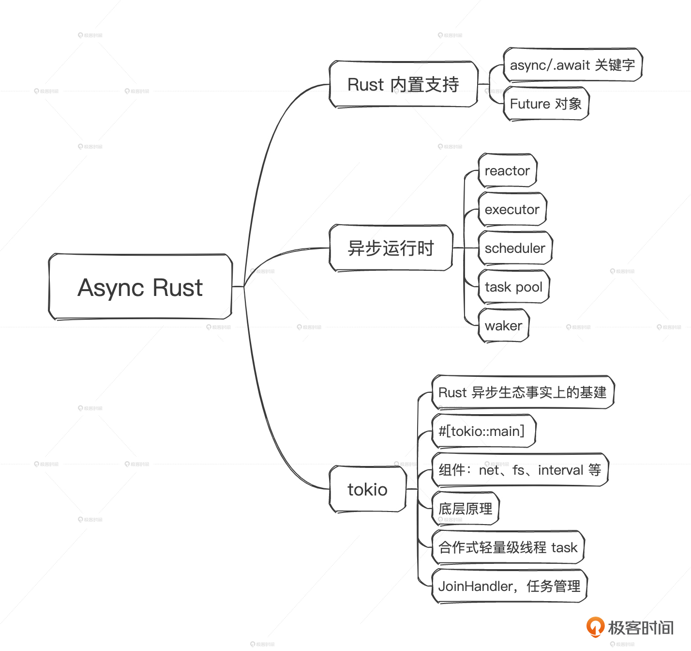

# 13 ｜独立王国：初步了解 Rust 异步并发编程

你好，我是 Mike。从今天开始，我们会用几节课的时间系统学习 Rust 异步并发编程。

和其他语言不大一样的是，异步 Rust（async Rust）相当于 Rust 世界里的一块儿新的王国，这个王国有一定的独立性，有它突出的特点。当然，独立并不代表封闭，我们前面所有的知识和经验仍然能顺利地在这个王国里发挥作用。

## async rust

从 Rust v1.39 版本以后，Rust 引入了 async 关键字，用于支持异步编程的工程学体验，使程序员可以用已经习惯了的同步代码书写方式来编写异步代码。

如果你了解过早期的 JavaScript 语言，你可能会对回调模式以及“回调地狱”有所了解。感兴趣的话，你可以搜索“回调地狱”这个关键词，看看它是如何产生的，以及可以用什么方式去解决。

JavaScript 在 ECMAScript 2017 版本中引入了 `async/await` 关键字组合，用于改进 JavaScript 中异步编程体验，从此以后程序员可以用顺序的逻辑书写方式来写出异步执行的代码，而不是那种用回调方式把一段连续的逻辑切割成一小块一小块的。

Rust 其实也差不多，它用类似的方式引入了 `async/.await` 关键字对。如果你对 Mozilla 公司有所了解的话，就不会感觉奇怪了，Mozilla 是互联网标准组织的重要成员，JavaScript 之父就在 Mozilla 公司，参与了 JavaScript 标准制定的全过程。同时，Mozilla 还推出了 Rust 语言以及 WebAssembly 字节码规范。

### async 函数和块（代码片段）

在 Rust 中，用上 async 的函数长这样：

```rust
async fn foo() {

}
```

也就是在原来的 fn 前加上 async 修饰。另外，还有所谓的 async 块，也就是直接在 async 后面加花括号。

```rust
fn foo() {
    async {
      // 这就是async块
    };
}

fn foo() {
    async move {
      // 加move，类似闭包，明确标识把用到的环境变量移动进来
    };
}
```

上面的函数是可以编译通过的，但是这样写本身会有一些问题。

提示：

```rust
futures do nothing unless you `.await` or poll them
```

翻译出来就是：futures 不做任何事情，除非你用 `.await` 或轮询它们。

Rust 中，async 函数或块会被视作一个 Future 对象，类似于 JS 里的 Promise，async 关键字只是用来定义这个 Future 对象，定义好的这片异步代码并不会自动执行，而是需要和 async 配对的 `.await` 去驱动它才会执行。

比如像下面这样：

```rust
fn foo() {
    let a = async {};
    a.await;            // 用.await驱动异步块
}
// 或者更紧凑的写法
fn foo() {
    async {}.await;
}
```

但是，上述代码是没办法通过编译的，会报这个错。

```rust
error[E0728]: `await` is only allowed inside `async` functions and blocks
```

它提示说， `await` 关键字只能在 async 块或函数里使用。

于是得改成这样才行：

```rust
async fn foo() {
    let a = async {};
    a.await;
}
```

这里我们看到两条规则。

1. 用 async 定义异步代码，用 `.await` 驱动执行。
2. 但是 `.await` 又只能在 async 块中调用。

细心的你可能一下子就推理出来了，这不就是鸡和蛋的问题吗？那么第一个最外层的 async 代码块或函数如何被调用呢？

我们知道，Rust 的程序都是从 main 函数开始执行的。

```rust
fn main() {
}
```

即使是异步代码，也不能破坏这个规则。

我们试着这样写：

```rust
async fn main() {      // 在main函数前加一个async修饰
    let a = async {};
    a.await;
}
```

会报错：

```rust
error[E0752]: `main` function is not allowed to be `async`
```

Rust 明确规定了，main 函数前不能加 async 修饰。也就是说，只能写成这种形式。

```rust
fn main() {
    let a = async {};
    a.await;
}
```

但是前面又说过了， `.await` 只能写在 async 代码块或函数里。我们进入了一个两难的境地。如果就在目前这个体系里面寻找解决方案的话，那只能原地打转。

**这里必然要引入一种外部驱动机制**。比如，有一个辅助函数，它可以接收 Future，并驱动它，而不需要使用 `.await`。像下面这样就行了。

```rust
fn main() {
    let a = async {};
    block_on(a);  // 辅助驱动函数 block_on
}
```

那么，这个 `block_on()` 到底是什么呢？

**这个 `block_on()` 可不是一个普通的函数，它必须是一个运行时（Runtime）的入口。在它下面，蕴藏着一整套运行时机制。**

到目前为止，我们已经知道，仅仅利用我们之前学到的 Rust 知识，还驱动不了异步代码，必须要借助于一种新的叫做运行时（Runtime）的机制才能处理。

目前 Rust 标准库中还没有内置一个官方的异步 Runtime，不过 Rust 生态中有很多第三方的 Runtime 实现库，比如 tokio、async-std 等。而其中 tokio 应用最为广泛。 **通过几年的时间，tokio 在第三方异步 Runtime 的激烈竞争中胜出，可以说它现在已经成为了 Rust 生态中异步运行时事实上的标准。**

我们下面就开始讲解这个运行时机制。

### 异步运行时是什么？

异步运行时是一个库，这个库包含一个响应器（reactor）和一个或多个执行器（executor）。它需要处理哪些事情呢？

1. 执行异步代码。
2. 遇到 `.await` 的时候，判断能不能获取到结果。如果不能，CPU 不会一直阻塞等，而是缓存当前任务的状态，然后将当前任务挂起，放到内部一个任务池中，同时向 OS 注册要监听等待的外部事件。
3. 询问或执行其他任务。如果所有任务都暂时没有进展，就会进入一个空闲（idle）状态，不会使 CPU 忙等待。
4. 只要某个任务对应所监听到的信号来了，也就是说有结果返回了，就会把对应的任务重新捡起来，并从缓存中恢复暂停前的状态，继续往下执行。从代码上看，就是从上一个 `.await` 后面的代码继续往下执行。
5. 遇到下一个 `.await`，就重复第 1 步～第 4 步。
6. 直到这个异步代码（函数）执行完毕，完成操作或返回结果。

总结起来，就是这 6 项任务。

1. 异步代码的执行；
2. 任务的暂停；
3. 状态的缓存；
4. 外部事件的监听注册；
5. 外部信号来了后，唤醒对应的任务，恢复任务状态；
6. 多个任务间的调度。

总之，Rust 异步运行时要干的事情还不少。要设计一个高效的异步运行时是一件相当有技术挑战的工作。后面我们会以 tokio 为例来介绍 Rust 中的异步编程。

## tokio 异步编程

下面我们来熟悉一下基于 tokio runtime 的代码范例。

### 引入依赖

首先，你得在 Cargo.toml 中引入 tokio 依赖。

```rust
tokio = { version = "1", features = ["full"] }
```

### main 函数

然后，我们把 tokio 提供的一个属性宏标注在 main 函数上面，这样 main 函数前就可以加 async 修饰了。

像下面这样：

```rust
#[tokio::main]      // 这个是tokio库里面提供的一个属性宏标注
async fn main() {   // 注意 main 函数前面有 async
    println!("Hello world");
}
```

这个 `#[tokio::main]` 做的事情其实就是把用 async 修饰的 main 函数展开，展开会类似下面这个样子：

```rust
fn main() {
    tokio::runtime::Builder::new_multi_thread()
        .enable_all()
        .build()
        .unwrap()
        .block_on(async {              // 注意这里block_on，里面是异步代码
            println!("Hello world");
        })
}
```

也就是在 main 函数里构建一个 Runtime 实例，第二行代码的意思是 tokio 库下 Runtime 模块的 Builder 类型里的 `new_multi_thread()` 函数，整个路径用 `::` 号连接， `::` 也叫路径符。这个函数创建的是多线程版本的 Runtime 实例。

`.enable_all()` 用于打开默认所有配置， `.build()` 用于真正创建实例，它返回一个用 Result 包起来的结果， `.unwrap()` 把这个 Result 解开，把 Runtime 实例拿出来，然后在这个实例上调用 `.block_on()` 函数。整个过程用的是 **链式调用风格**，这个风格在其他语言中也很普遍，只要遵循前一个函数调用返回自身或者新的对象即可。

`block_on()` 会执行异步代码，这样就把异步代码给加载到这个 Runtime 实例上并驱动起来了。

tokio 还可以基于当前系统线程创建单线程的 Runtime，你可以看一下示例。

```rust
#[tokio::main(flavor = "current_thread")]  // 属性标注里面配置参数
async fn main() {
    println!("Hello world");
}
```

展开后，是这个样子的：

```rust
fn main() {
    tokio::runtime::Builder::new_current_thread()  // 注意这一句
        .enable_all()
        .build()
        .unwrap()
        .block_on(async {
            println!("Hello world");
        })
}
```

单线程的 Runtime 由 `Builder::new_current_thread()`  函数创建，代码的其他部分和多线程 Runtime 都一样。

### 代码示例

这里，我们先看几个例子，来了解一下基于 tokio 的代码长什么样子。

#### 文件写

下面的例子展示了如何基于 tokio 做文件的写操作。

```rust
use tokio::fs::File;
use tokio::io::AsyncWriteExt;     // 引入AsyncWriteExt trait

async fn doit() -> std::io::Result<()> {
    let mut file = File::create("foo.txt").await.unwrap();  // 创建文件
    file.write_all(b"hello, world!").await.unwrap();        // 写入内容
    Ok(())
}

#[tokio::main]
async fn main() {
    let result = doit().await;   // 注意这里的.await
}
```

#### 文件读

下面的例子展示了如何基于 tokio 做文件的读操作。

```rust
use tokio::fs::File;
use tokio::io::AsyncReadExt;   // 引入AsyncReadExt trait

async fn doit() -> std::io::Result<()> {
    let mut file = File::open("foo.txt").await.unwrap();  // 打开文件
    let mut contents = vec![];
    // 将文件内容读到contents动态数组里面，注意传入的是可变引用
    file.read_to_end(&mut contents).await.unwrap();
    println!("len = {}", contents.len());
    Ok(())
}

#[tokio::main]
async fn main() {
    let result = doit().await;  // 注意这里的.await
    // process
}
```

可以看到，Rust 的异步代码和 JavaScript 的异步代码非常类似，只不过 JavaScript 的 await 关键字是放在语句前面的。

#### 定时器操作

下面的例子展示了如何基于 tokio 做定时器操作。

```rust
use tokio::time;
use std::time::Duration;

#[tokio::main]
async fn main() {
    // 创建Interval实例
    let mut interval = time::interval(Duration::from_millis(10));
    // 滴答，立即执行
    interval.tick().await;
    // 滴答，这个滴答完成后，10ms过去了
    interval.tick().await;
    // 滴答，这个滴答完成后，20ms过去了
    interval.tick().await;
}
```

上面示例里的时间段， `Duration::from_millis(10)` 表示创建一个 10ms 的时间段，我们在其他语言中更多是习惯直接传入一个数字，比如传 10000 进去，默认单位是 us。但是前面我们说过，Rust 中会尽可能地类型化，因此这里定义了一个 Duration 类型，它可以接收来自 s、ms、us 等单位的数值来构造时间段。在这点上，Java 和 Rust 是比较像的。

### tokio 组件

tokio 发展到现在，已经是一个功能丰富、机制完善的 Runtime 框架了。它针对异步场景把 Rust 标准库里对应的类型和设施都重新实现了一遍。具体包含 6 个部分。

- Runtime 设施组件：你可以自由地配置创建基于系统单线程的 Runtime 和多线程的 Runtime。
- 轻量级任务 task：你可以把它理解成类似 Go 语言中的 Goroutine 这种轻量级线程，而不是操作系统层面的线程。
- 异步输入输出（I/O）：网络模块 net、文件操作模块 fs、signal 模块、process 模块等。
- 时间模块：定时器 Interval 等。
- 异步场景下的同步原语：channel、Mutex 锁等等。
- 在异步环境下执行计算密集型任务的方案 `spawn_blocking` 等等。

通过对这些基础设施的重新实现，tokio 为 Rust 异步编程的生态打下了坚实的基础，通过几年的发展，一些上层建筑蓬勃发展起来了。比如：

- Hyper：HTTP 协议 Server 和 Client 的实现
- Axum：Web 开发框架
- async-graphql：GraphQL 开发框架
- tonic：gRPC 框架的 Rust 实现
- ……

### tokio 底层机制

下面我们来看一下 tokio 的底层魔法到底是什么？



最底层是硬件、CPU 等。在其上是操作系统，Linux、Windows、macOS 等。不同的操作系统会提供不同的异步抽象机制，比如 Linux 下有 epoll，macOS 下有 kqueue。

Tokio 的异步 Runtime 能力实际正是建立在操作系统的这些异步机制上的。Tokio 的 reactor 用来接收从操作系统的异步框架中传回的消息事件，然后通知 tokio waker 把对应的任务唤醒，放回 tokio executor 中执行。每一个任务会被抽象成一个 Future 来独立处理，而每一个 Future 在 Rust 中会被处理成一个结构体，用状态机的方式来管理。Tokio 中还实现了对这些任务的安排调度机制。

注：官方的 [async book](https://rust-lang.github.io/async-book/) 有对这个专题更深入的讲解：不过这本异步书写得偏难，并不适合新手，有兴趣的话可以翻阅一下。

### task：轻量级线程

tokio 提供了一种合作式（而非抢占式）的任务模型：每个任务 task 都可以看作是一个轻量级的线程，与操作系统线程相对。操作系统默认的线程机制需要消耗比较多的资源，一台普通服务器上能启动的总线程数一般最多也就几千个。而 tokio 的轻量级线程可以在一台普通服务器上创建上百万个。

#### M：N 模型

tokio 的这个模型是一种 M：N 模型，M 表示轻量级线程的数量，N 表示操作系统线程的数量。也就是说，它实际是将所有的轻量级线程映射到具体的 N 个操作系统线程上来执行，相当于在操作系统线程之上抽象了一层，这层抽象是否高效正是衡量一个 Runtime 好坏的核心标准。其中，操作系统线程数量 N 是可以由开发者自行配置的，最常用的默认配置是一个机器上有多少 CPU 逻辑处理器核，N 就等于多少。

#### 合作式

同时，tokio 的轻量级线程之间的关系是一种合作式的。合作式的意思就是同一个 CPU 核上的任务大家是配合着执行（不同 CPU 核上的任务是并行执行的）。我们可以设想一个简单的场景，A 和 B 两个任务被分配到了同一个 CPU 核上，A 先执行，那么，只有在 A 异步代码中碰到 `.await` 而且不能立即得到返回值的时候，才会触发挂起，进而切换到任务 B 执行。

当任务 B 碰到 `.await` 时，又会回去检查一下任务 A 所 await 的那个值回来没有，如果回来了就唤醒任务 A，从之前那个 `.await` 后面的语句继续执行；如果没回来就继续等待，或者看看能不能从其他核上拿点任务过来执行，因为此时任务 A 和任务 B 都在等待 await 的值回来。任何一个 task 里 await 的值回来后（会由操作系统向 tokio 通知一个事件），tokio 就会唤醒对应的 task 继续往下执行。

也就是说，在一个 task 没有遇到 `.await` 之前，它是不会主动交出这个 CPU 核的，其他 task 也不能主动来抢占这个 CPU 核。所以 tokio 实现的这个模型叫做合作式的。和它相对的，Go 语言自带的 Runtime 实现的 Goroutine 是一种抢占式的轻量级线程。

#### 非阻塞

从前面代码的示范及讲解可以看到，在程序员这个视角看来，代码层面的效果是一个 task（一段异步代码）遇到 `.await` 时，看起来就好像是被阻塞住了，会等待请求结果的返回。而从 tokio 底层的运行和调度机制来看，它又是非阻塞的。非阻塞的意思是，一个轻量级线程 task 的“卡住”，不会把用来承载它的操作系统线程给真正地卡住，OS 线程被调度了新的任务执行。这样，CPU 资源就没有被浪费。

这个 task 之间的调度工作是在 tokio 内部自动完成的，对程序员来说是不可见的。这样就带来了巨大的好处，程序员写异步并发代码，就跟之前写同步代码基本一样，顺着将逻辑写下去就行了。而不会因为去适应异步回调而把代码逻辑打碎分散到文件的各个地方。所以，tokio 的 task 在真正执行的时候是非阻塞的，不会对系统资源造成浪费。

下面我们来看一下如何创建 tokio task，这需要使用 `task::spawn()` 函数。

```rust
use tokio::task;

#[tokio::main]
async fn main() {
    task::spawn(async {
        // 在这里执行异步任务
    });
}
```

在这个示例里，main 函数里面创建了一个新的 task，用来执行具体的任务。我们需要知道，tokio 管理下的 `async fn main() {}` 本身就是一个 task，相当于在 main task 中，创建了一个新的 task 来执行。这里，main task 就是父 task，新创建的这个 task 是子 task。

那聪明的你可能要问了，这两个 task 之间的生存关系是怎样的呢？它们其实是没有关系的。在 tokio 中，子 task 的生存期有可能超过父 task 的生存期，也就是父 task 执行结束了，但子 task 还在执行。如果在父 task 里要等待子 task 执行完，再结束自己，保险的做法是用 JoinHandler。

注：在 main 函数中有更多细节，如果 main 函数所在的 task 先结束了，会导致整个程序进程退出，有可能会强制杀掉那些新创建的子 task。

```rust
use tokio::task;

#[tokio::main]
async fn main() {
    // 在这里执行异步任务
    let task_a = task::spawn(async {
        "hello world!"
    });
    // ...
    // 等待子任务结束，返回结果
    let result = task_a.await.unwrap();
    assert_eq!(result, "hello world!");
}
```

JoinHandler 是什么意思呢？这个新概念跟 task 的管理相关。我们在 main task 中里创建一个新 task 后， `task::spawn()` 函数实际有一个返回值，它返回一个 handler，这个 handler 可以让我们在 main task 里管理新创建的 task。这个 handler 也可以用来指代这个新的 task，相当于给这个 task 取了一个名字。比如示例里，我们就把这个新的任务命名为 task_a，它的类型是 JoinHandler。在用 `spawn()` 创建 task_a 后，这个新任务就 **立即执行**。

`task_a.await` 会返回一个 Result，所以上面代码中，需要加一个 `unwrap()` 把 task_a 真正的返回内容解包出来。至于对 task 的 `.await` 为什么会返回一个 Result，而不是直接返回异步任务的返回值本身，是因为 task 里有可能会发生 panic。你可以看一下例子。

```rust
use tokio::task;

#[tokio::main]
async fn main() {
    let task_a = task::spawn(async {
        panic!("something bad happened!")
    });
    // 当task_a里面panic时，对task handler进行.await，会得到Err
    assert!(task_a.await.is_err());
}
```

由于 task 可能会 panic，所以就得对 task 的返回值用 Result 包一层，这样方便在上一层的 task 里处理这种错误。 **在 Rust 中，只要过程中有可能返回错误，那就果断用 Result 包一层作为返回值，这是典型做法。**

有了 JoinHandler，我们可以方便地创建一批新任务，并等待它们的返回值。你可以看一下示例。

```rust
use tokio::task;

async fn my_background_op(id: i32) -> String {
    let s = format!("Starting background task {}.", id);
    println!("{}", s);
    s
}

#[tokio::main]
async fn main() {
    let ops = vec![1, 2, 3];
    let mut tasks = Vec::with_capacity(ops.len());
    for op in ops {
        // 任务创建后，立即开始运行，我们用一个Vec来持有各个任务的handler
        tasks.push(tokio::spawn(my_background_op(op)));
    }
    let mut outputs = Vec::with_capacity(tasks.len());
    for task in tasks {
        outputs.push(task.await.unwrap());
    }
    println!("{:?}", outputs);
}
// 输出
Starting background task 1.
Starting background task 2.
Starting background task 3.
```

上面示例里，我们用 tasks 这个动态数组持有 3 个异步任务的 handler， **它们是并发执行的**。然后对 tasks 进行迭代，等待每个 task 执行完成，并且搜集任务的结果放到 outputs 动态数组里。最后打印出来。

可以看到，在 tokio 中创建一批任务并发执行非常简单，循环调用 `task::spawn()` 就行了，并且还能对创建的任务进行管理。

### 哪些操作要加 `.await`？

到目前为止，我们已经初步感知到了 tokio 的强大能力，确实很好用，也很直观。但是我们还有一个疑惑，在写异步代码的时候，我怎么知道哪些地方该加 `.await`，哪些地方不该加呢？

一个总体的原则是， **涉及到 I/O 操作的，都可以加**，因为 tokio 已经帮我们实现了一份异步的对应于 Rust 标准库的 I/O 实现。最常见的 I/O 操作就是网络 I/O、磁盘 I/O 等等。具体来说，有几大模块。

- net 模块：网络操作；
- fs 模块：文件操作；
- 定时器操作：Interval、sleep 等函数；
- channel：四种管道 oneshot、mpsc、watch、broadcast；
- signal 模块：系统信号处理；
- process 模块：调用系统命令等。

具体可以查看 [tokio API](https://docs.rs/tokio/1.32.0/tokio/index.html)。在查看 API 文档的时候，只要那个接口前面有 async 关键字修饰，那么使用的时候就需要加 `.await`。比如， `tokio::fs::read()` 的定义就是这样的：

```rust
pub async fn read(path: impl AsRef<Path>) -> Result<Vec<u8>>
```

而像其他的一些数据结构的基本操作，比如 `Vec<T>`、 `HashMap<K, V>` 的操作等，由于它们都是在内存里执行，它们的接口前面也没有 async 关键字修饰，所以不需要也不能加 `.await`。

## 小结

这节课我们一起学习了 Async Rust 和 tokio 相关的基本概念。Async Rust 在整个 Rust 的体系中，相对于 std Rust 来讲是一片新的领地。



Rust 中的 async 代码具有 **传染性**，也就是说一个函数如果要调用一个 async 函数的话，它本身也需要是 async 函数。Rust 在语言层面提供了 `async/.await` 语法的支持，但是其并没有提供一个官方的异步运行时，来对异步代码的执行进行驱动。而 tokio 是整个 Rust 生态中经历过激烈竞争后的异步运行时胜出者，具有强大的功能、丰富的特性和广泛的使用度。

tokio 提供了一套轻量级线程模型，方便程序员使用 Rust 进行大规模并发程序开发，特别适合高性能 Web 服务器领域，也适合处理一般的异步业务。

## 思考题

为什么我们要把 async Rust 叫做“独立王国”呢？欢迎你把自己的思考分享到评论区，也欢迎你把这节课的内容分享给其他朋友，我们下节课再见！
