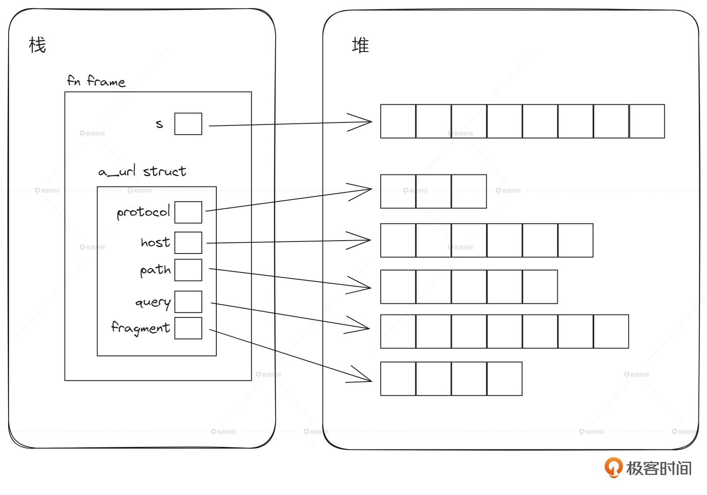
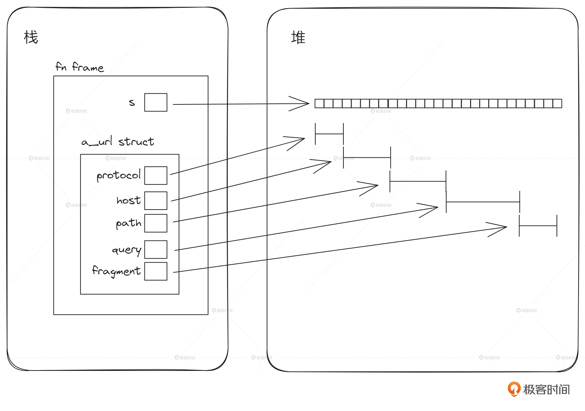
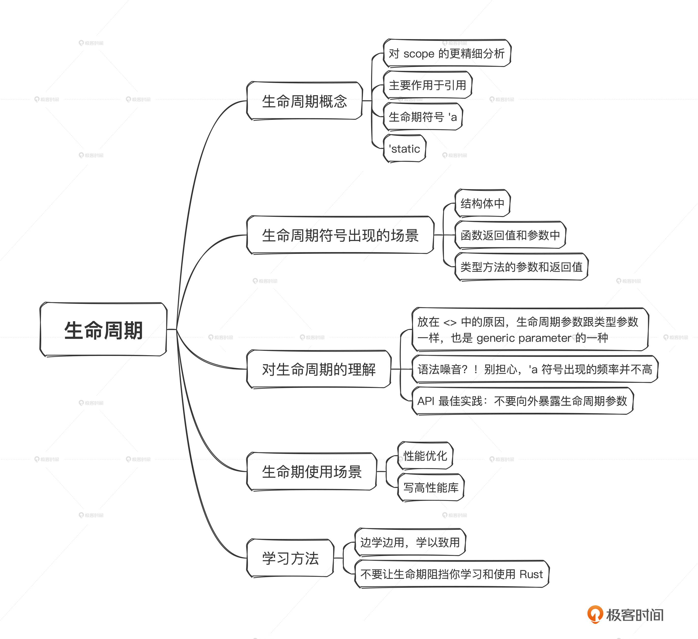

# 20 ｜生命周期：Rust 如何做基本的生命周期符号标注？

你好，我是 Mike，今天我们来了解一下 Rust 中的生命周期到底是什么。

你可能在互联网上的各种资料里早就见到过这个概念了，生命周期可以说是 Rust 语言里最难理解的概念之一，也是导致几乎所有人都觉得 Rust 很难，甚至很丑的原因。其实对于初学者来说，至少在开始的时候，它并不是必须掌握的，网上大量的资料并没有指明这一点，更加没有考虑到的是应该如何让初学者更加无痛地接受生命周期这个概念，而这也是我们这门课程尝试解决的问题。

下面让我们从一个示例说起，看看为什么生命周期的概念在 Rust 中是必要的。

## 从 URL 解析说起

URL 协议类似下面这个样子，可以粗略地将一个 URL 分割成 5 部分，分别是 protocol、host、path、query、fragement。


现在我们拿到一个 URL 字符串，比如就是图片里的这个。

```rust
let s = "https://rustcc.cn/article?id=019f9937#title".to_string();
```

现在要把它解析成 Rust 的结构体类型，按照我们已掌握的知识，先定义 URL 结构体模型，定义如下：

```rust
struct Url {
    protocol: String,
    host: String,
    path: String,
    query: String,
    fragment: String,
}
```

没有问题，URL 图示里的 5 大部分都已定义好了。解析出来大致就是这样一个效果。

```rust
let a_url = Url {
    protocol: "https".to_string(),
    host: "rustcc.cn".to_string(),
    path: "/article".to_string(),
    query: "id=019f9937".to_string(),
    fragment: "title".to_string(),
};
```

这样完全没有问题，我们把一个字符串切割成 5 部分，转换成了一个结构体。不过这并不算一种高效的做法，在计算机系统里面，会做 5 次堆内存分配的操作。我们来看一下字符串转换成结构体之后栈和堆的示意图。



也就是说，我们把一个大的字符串，分成了 5 个小的字符串，并且每个小的字符串在堆里都单独分配了一块内存，原理上确实没问题，但从计算机科学来讲，5 次堆内存的分配代价有点大。

那到底在性能上有什么问题呢？或者换句话问，有什么优化的方案呢？答案就是对于这种 **只读解析**，也就是没有修改需求的场景，我们不需要为每一个碎片单独分配一个堆内存，只需要定义 5 个切片引用就可以了。

在 Rust 语言里，你可以这样去定义这个结构体。

```rust
struct Url {
    protocol: &str,
    host: &str,
    path: &str,
    query: &str,
    fragment: &str,
}
```

但是这样是没法通过编译的，需要加上一个东西，就是 `<'a>`。

```rust
struct Url<'a> {
    protocol: &'a str,
    host: &'a str,
    path: &'a str,
    query: &'a str,
    fragment: &'a str,
}
```

然后像这样来创建 Url 实例。

```rust
let a_url = Url {
    protocol: &s[..5],
    host: &s[8..17],
    path: &s[17..25],
    query: &s[26..37],
    fragment: &s[38..43],
};
```

然后，创建出来的内存结构是这样的：



有看到区别吗？新的方式 Url 实例 a_url 里的 5 个字段 protocol、host、path、query、fragment 都只是存的切片引用，指向原始字符串 s 的某一个片断，不再单独分配一块块内存碎片了。这样整个过程就少分配了 5 次堆内存，解析出来的结构体占用内存比较少，而且解析过程中的性能很高。

这个示例反映了 Rust 语言的一大特点，就是 **提供了最大的可能性**，既可以简单粗暴侧重于易用性，先把东西做出效果，又可以用另外的方案从底层实现上做优化。 **这种优化在 Rust 语言就能完成，而不需要借助额外的语言或设施**。

从这个示例，我们引出了这样一种符号 `'a`。

```rust
struct Url<'a> {
    protocol: &'a str,
    host: &'a str,
    path: &'a str,
    query: &'a str,
    fragment: &'a str,
}
```

它是什么呢？

## Rust 中的生命周期

`'a` 这种符号是引用的生命周期符号，用来标识一个结构体里是否有对外部资源的引用，从而帮助 Rust 的借用检查器（Borrow Checker）对引用的有效性进行 **编译时** 分析。

和大部分语言一样，在 Rust 里，任何变量都有 scope，一般由最里层的花括号所定义。比如：

```rust
fn foo() -> {
    let a = String::from("abc");
    //
    {
      let b = String::from("def");
    }
}
```

例子里，变量 a 的 scope 为从定义时开始，到第 7 行 `foo()` 函数的花括号结束。而变量 b 的 scope 为从定义时开始到第 6 行花括号结束。

但这个规则在 Rust 中只是针对所有权型变量的。对引用型变量来说，在 Rust 里有更严格的 scope 要求。

```rust
fn foo() -> {
    let a = String::from("abc");
    let a_ref = &a;
    println!("{}", a_ref);
    //
}
```

例子中，对于引用型变量 `a_ref` 来讲，由于它持有的是对所有权型变量 a 的引用， `a_ref` 实际的 scope 只是从第 3 行定义时开始到第 4 行最后一次使用时结束（这个规则我们在 [第 3 讲](https://time.geekbang.org/column/article/720128) 中已经验证过），到不了第 6 行的花括号。也就是说，Rust 里的引用型变量的 scope 看起来总是要比对应的所有权型变量的 scope 要小。

这个很容易理解，因为所谓引用，就是必定有效的指针。 **必定有效的意思就是，只要这个引用型变量还在，那它所指向的那个目标对象就一定在**。Rust 中采用的是彻底的静态分析技术（相对于运行时检查），希望在编译期间能够清楚地计算出每个资源，还有指向这个资源的引用的有效存在区间。要准确，既不能多，也不能少，并且两个要匹配好。于是 Rust 引入了所有权的设计，来描述对资源的管理。这是一个根上的设计，它的引入不可避免地带来了一整套后续的机制。

- 借用与引用
  - 不可变引用
  - 可变引用
- 引用的生命周期分析

所有权的生命周期 scope 的分析是比较简单的，用所在层次花括号规则就可以处理。难点在于引用的生命周期 scope 的分析，这个工作就是由 Borrow Checker 来做的。因为代码逻辑可能非常复杂，很难找到一种智能的方法可以通用地并且完全正确地处理所有代码中的引用。这非常困难，编程语言发展了几十年，其他语言要么如 C 这种放弃治疗，把这个问题全部交给程序员自己处理，要么像 Java 这种引入 GC 层，用 GC 来统一管理对资源的引用。

因此目前阶段 Rust 还需要我们程序员人为地为它提供一些信息标注，而 `'a` 就是这样一种信息标注机制。有可能后面随着 AI 的蓬勃发展，未来能出现可靠的方案，我们就不再需要手动添加这些标注信息了，但目前还是需要的。

**`'a` 代表某一片代码区间，这片代码区间就是被这种符号标注的引用的有效存在区间。**

### 结构体中的引用

上面示例的结构体 Url 中， `<'a>` 是表示定义一个生命周期符号 `'a`，这个 `'a` 的名字可以任意取，比如取名 `'abc`、 `'h`、 `'helloworld` 等都是可以的。一般使用单小写字母表示，但是你如果看到单词形式的生命周期符号也不要惊讶。比如：

```rust
struct Url<'helloworld> {
  protocol: &'helloworld str,
  // ...
}
```

定义好 `'a` 符号后，需要标注到目标的引用上面去，上述示例中，&str 的 & 和 str 之间，加 `'a`，写成 `&'a str`。这样就表示 **结构体 Url 依赖一个外部资源**，具体来说，是其 protocol 字段依赖于一个外部的字符串。在上述示例中，Url 的 5 个字段都依赖于同一个外部字符串资源，因此只需要一个生命周期参数 `'a` 就行了。如果是依赖于不同的字符串资源，可以分开写成不同的生命周期参数 `'a`、 `'b` 等。比如：

```rust
struct Url<'a, 'b, 'c> {
    protocol: &'a str,
    host: &'a str,
    path: &'b str,
    query: &'b str,
    fragment: &'c str,
}
```

上面的定义中，Url 定义了三个生命周期参数 `'a`、 `'b`、 `'c`。从这个定义我们能清晰地看出，Url 类型 **可能** 依赖于 3 个外部字符串资源。

当在类型上添加了生命周期符号标注后，对它做 impl 的时候也需要带上这个参数了。

```rust
struct Url<'a> {
    protocol: &'a str,
    host: &'a str,
    path: &'a str,
    query: &'a str,
    fragment: &'a str,
}

impl<'a> Url<'a> {    // 这里
    fn play() {}
}
```

请注意上面代码里的第 9 行 impl 后定义的 `<'a>` 参数，你可以发现 `'a` 的地位好像与类型参数 T 类似。

生命周期符号 `'a` 具有传染性。比如，一个结构体用于构建另一个结构体字段的时候。

```rust
struct Url<'a> {
    protocol: &'a str,
    // ...
}

struct Request<'a> {
    url: Url<'a>,
    body: String,
    // ...
}
```

上面示例里，Request 结构体中包含一个 Url 结构体的实例，因为 Url 类型带生命周期参数 `'a`，因此 Request 中也 **不得不** 带上同一个生命周期参数 `'a`。这就是 **生命周期参数的传染性**。

这样标识是有好处的，因为 Url 的实例依赖于外部所有权资源，那么顺推 Request 类型的实例也要依赖于那些外部所有权资源。如果不标识，当嵌套层次过多了之后，你很难用肉眼分析出一个结构体类型到底是不是 **自包含**（self-contained，也就是由自己掌握涉及资源的所有权）的。

好在 Rust 的严格性，要求你必须依次一个不差地标识出来，这样就不会出现潜在的问题了。不过总的来说，生命周期符号 `'a` 主要还是帮助 Rust 编译器的，而不是给程序员看的。程序员的直观感觉是它非常丑陋而且带来语法噪音。

在目前的技术能力下，通过引入生命周期符号标注，Rust 能实现精准地分析引用的有效期。

### 函数返回值中的引用

除了结构体中，在其他语言元素上也会出现引用的场景。一大场景就是函数返回值中带引用，我们看下面这个函数。

```rust
fn foo() -> &str {
    let s = String::from("abc");
    &s
}
```

我们想返回 `foo` 函数里的局部变量 s 的引用，可以吗？肯定是不可以的。所有权变量 s 在 `foo()` 函数执行完后就被回收了，返回对这个字符串资源的引用不就是悬挂指针了吗？编译提示如下：

```rust
error[E0515]: cannot return reference to local variable `s`
 --> src/main.rs:3:5
  |
3 |     &s
  |     ^^ returns a reference to data owned by the current function
```

那么，一个函数中返回一个类型的引用，有几种可能的情况呢？只有两种，一种是返回对外部全局变量的引用；另一种是返回函数的引用参数所指向资源的引用。

我们先看第一种情况。

```rust
static ASTRING: &'static str = "abc";
fn foo() -> &str {
    ASTRING
}
```

这是可以的。但实际这样写的价值不大，没多大用。

第二种情况：

```rust
fn foo(a: &str) -> &str {
    a
}
```

这也是可以的，但这种只有一个引用类型的参数传入，再返回回去，好像也没多大意思。如果有多个引用类型的参数传入呢？比如：

```rust
fn foo(a: &str, b: &str) -> &str {
    a
}
```

Rust 编译器开始抱怨了。

```rust
error[E0106]: missing lifetime specifier
 --> src/lib.rs:1:29
  |
1 | fn foo(a: &str, b: &str) -> &str {
  |           ----     ----     ^ expected named lifetime parameter
  |
  = help: this function's return type contains a borrowed value, but the signature does not say whether it is borrowed from `a` or `b`
help: consider introducing a named lifetime parameter
  |
1 | fn foo<'a>(a: &'a str, b: &'a str) -> &'a str {
  |       ++++     ++          ++          ++
```

它抱怨说，你少写了一个生命周期参数，因为函数的返回类型中包含一个借用值，但是函数签名中没有说这个借用是来自 a 还是 b。然后还给出了一个建议，在函数参数和返回类型上，都加上生命周期参数 `'a`，就是像下面这个样子。

```rust
fn foo<'a>(a: &'a str, b: &'a str) -> &'a str {
    a
}
```

类似于在结构体上定义生命周期参数，在函数签名中，如果要引入生命周期参数，也需要先定义，就是定义在函数名 `foo` 后的 `<>` 里。先定义，再使用。定义之后，在后面的引用上才能使用这个符号。

但是我们函数实现中明确写了返回 a 的，感觉 Rust 略笨。实际上到目前为止，Rust 只会基于函数签名，也就是传入传出的类型进行分析，而不会去分析函数体的实现，也就是不会去分析函数中的实现逻辑。只要返回值的类型没有问题，它就不会抱怨。我们再看一个示例。

```rust
fn foo(i: u32, a: &str, b: &str) -> &str {
    if i == 1 {
        a
    } else {
        b
    }
}
// 也需要写成
fn foo<'a>(i: u32, a: &'a str, b: &'a str) -> &'a str {
    if i == 1 {
        a
    } else {
        b
    }
}
```

这个示例中，到底返回 a 还是 b，在编译期是没办法确定下来的，只能在运行的时候，由具体传入的 `i` 值来确定。不过，Rust 分析的时候，不关心这个具体的逻辑，它只看函数签名中的引用之间，有没有可能会发生关联。

```rust
fn foo<'a>(a: &'a str, b: &'a str) -> &'a str {
```

在 foo 函数签名中出现了 4 次 `'a` 符号，除去第一个是定义 `'a`，后面 3 次都是使用 `'a`。这后面三个不同位置的 `'a` 的意义到底是什么呢？

首先，foo 函数的两个参数 a、b，它是外部字符串资源的引用。它们所指向的字符串资源，有两种情况：

1. 为同一个字符串资源；
2. 为两个不同的字符串资源。

第一种情况比较好理解，返回的引用仍然指向这个字符串资源，因此它们标注为同一个 `'a` 生命周期参数符号。

第二种情况稍微复杂一些。a 和 b 指向的是不同的字符串资源，对应的资源我们标记为 Ra 和 Rb，Ra 和 Rb 有各自的 scope。a 是 Ra 的引用，b 是 Rb 的引用，我们强行在这两个不同资源的引用上标注相同的生命周期参数 `'a`，它一定是做了某种操作，提供一些额外的信息。

因为 Ra 和 Rb 的 scope 一般不一样，我们假设 Rb 资源先释放，Ra 资源后释放。那我们首先要保证的是在 `foo()` 函数执行期间，Ra 和 Rb 都存在。在 a 和 b 的类型上强制标识 `'a`， **实际上是给 `'a` 取了一个比较小的代码区间**，也就是到 Rb 的资源释放的那一行代码为止。

同时我们还把 `'a` 标注到返回类型上，就 **意味着将 `'a` 指代的生命周期区间施加到了返回的引用上**。我们可以用下面这个示例来验证这个论断。

```rust
fn longest<'a>(x: &'a str, y: &'a str) -> &'a str {
    if x.len() > y.len() {
        x
    } else {
        y
    }
}

fn main() {
    let s1 = String::from("long string is long");
    let result;
    {
        let s2 = String::from("xyz");
        result = longest(s1.as_str(), s2.as_str());
    }
    println!("The longest string is {}", result);
}
```

编译会报错：

```rust
error[E0597]: `s2` does not live long enough
  --> src/main.rs:14:39
   |
13 |         let s2 = String::from("xyz");
   |             -- binding `s2` declared here
14 |         result = longest(s1.as_str(), s2.as_str());
   |                                       ^^^^^^^^^^^ borrowed value does not live long enough
15 |     }
   |     - `s2` dropped here while still borrowed
16 |     println!("The longest string is {}", result);
   |                                          ------ borrow later used here
```

从我们肉眼分析来看，result 变量最后取的是 s1 的引用，并没有借用 s2，它应该是在 main 函数里一直有效的，就是第 16 行应该能打印出正确的值。但是编译却不通过，为什么呢？

就是因为 **Rust 是按生命周期来分析借用的，而不是靠函数逻辑**。在这个例子里，Rust 会分析出来， `longest()` 函数返回值的生命周期 `'a`，是到代码第 15 行，也就是 s2 被回收的地方，前面我们说过，会在 s1 和 s2 两个资源的 scope 中取较小的那个区间。也就是说，result 这个引用型变量的 scope 到第 15 行为止，所以在第 16 行就不能再使用它了。这个例子你可以仔细体会一下。

是不是有点反直觉？如果靠我们人眼去分析，这个例子应该是可以正常打印的。这也是 Rust 初学者常常疑惑而且崩溃的地方，不太好懂。你可以骂一下，Rust 傻。确实傻，目前分析领域的技术还做不到完美解决这个问题，所以有点傻，我们只能希望在未来的版本迭代中逐渐增强 Rust 的推理能力。

### 类型方法中的引用

回顾前面的内容，类型的方法只是第一个参数为 Self 的所有权或引用类型的函数。因此上面分析的函数返回值里引用的细节也适用于类型的方法。

比较特别的是，如果返回的值是 Self 本身或本身一部分的引用，就不用手动写 `'a` 生命周期符号，Rust 会自动帮我们在方法返回值引用的生命周期和 Self 的 scope 之间进行绑定，这是一条默认的规则。

```rust
struct A {
    foo: String,
}

impl A {
    fn play(&self, a: &str, b: &str) -> &str {
        &self.foo
    }
}
```

我们稍稍改一下代码就没办法编译通过了。

```rust
struct A {
    foo: String,
}

impl A {
    fn play(&self, a: &str, b: &str) -> &str {
        a
    }
}
```

编译提示：

```rust
error: lifetime may not live long enough
 --> src/lib.rs:8:9
  |
7 |     fn play(&self, a: &str, b: &str) -> &str {
  |             -         - let's call the lifetime of this reference `'1`
  |             |
  |             let's call the lifetime of this reference `'2`
8 |         a
  |         ^ method was supposed to return data with lifetime `'2` but it is returning data with lifetime `'1`
  |
help: consider introducing a named lifetime parameter and update trait if needed
  |
7 |     fn play<'a>(&'a self, a: &'a str, b: &str) -> &str {
  |            ++++  ++           ++
```

解释说，本来我们期望方法返回类型的生命周期为 Self 的生命周期，结果你给我返回了另一个资源的生命周期，我并不认识那个资源，所以需要你手动标注。并且给出了修改建议，我们按建议修改一下。

```rust
struct A {
    foo: String,
}

impl A {
    fn play<'a>(&'a self, a: &'a str, b: &str) -> &str {
        a
    }
}
```

这下就可以通过了。可以看到上面示例里的 play 方法在参数 a、参数 self 和返回值之间进行了绑定。

### 'static

在所有的生命周期参数符号里有一个是特殊的，那就是 'static，它代表所有生命周期中最长的那一个，和程序存在的时间一样长。它表示被标注的引用所指向的资源在整个程序执行期间都是有效的。比如：

```rust
fn main() {
    let s: &'static str = "I have a static lifetime.";
}
```

上面这个示例应该很容易理解，因为字符串字面量是存储在静态数据区的，程序存在多久，它就存在多久，它对应的局部变量 s（&'static str）的生命周期也就跟着可以持续到程序结束。

因此 'static 是所有生命周期符号中最长的一个。

## 对生命周期的理解

### 为什么放在尖括号中？

在前面的讲解中我们看到，生命周期参数是放在 `<>` 尖括号里的。回想一下之前的知识点，只有类型参数才会放在尖括号里，为什么生命周期参数也放在这里面呢？

如果用一句话解释，那就是因为 **生命周期参数跟类型参数一样，也是 generic parameter 的一种**，所以放在尖括号里，它俩的地位相同。

我们的程序跑起来，哪些资源会在什么时间分配出来，哪些资源会在什么时间回收，其实是个运行期间的概念。也就是说，是个时间上的概念。但对计算机来讲，每一条指令的执行，是要花相对确定的时间长度的，所以就在要执行的 CPU 指令条数和执行时间段上产生了正比映射关系。这就让我们在代码的编译期间去分析运行期间变量的生存时间区间变成可能。这就是 Rust 能够做生命周期分析的原因。

当我们使用生命周期参数标注 `'a` 的时候，并不能知道它所代表的将要运行的准确时间区间，或者说代码区间。比如对于函数来说，有可能它只运行一次，也有可能运行多次，运行在不同次数的时候，同一个 `'a` 参数可能代表的代码区间是不一样的。举例如下：

```rust
fn foo<'a>(a: &'a str, b: &'a str) -> &'a str {
    a
}

fn main() {
    {
        let s1 = "abc".to_string();
        let s2 = "def".to_string();
        let s3 = foo(&s1, &s2);
        println!("{}", s3);
    }
    // ...
    let s4 = "ghk".to_string();
    let s5 = "uvw".to_string();
    let s6 = foo(&s4, &s5);
    println!("{}", s6);
}
```

在上面示例中， `foo()` 函数被调用了两次。在第一次调用的时候， `'a` 代表的生命周期区间是到第 11 行的花括号截止。在第二次调用的时候， `'a` 代表的生命周期区间是到第 17 行的花括号截止。所以两次 `'a` 的值是不同的。这也是我们要把 `'a` 叫做生命周期参数的原因。

`'a` 代表代码区间或时间区间，在编译的时候，通过分析才会确定下来。因此和类型参数类似，我们也要把这种生命周期参数放到尖括号里定义。 **类型参数是空间上的展开（分析），生命周期参数是时间上的展开（分析）**。

### 关于 `'a` 的语法噪音

前面我们讲解了 Rust 引入生命周期分析和生命周期参数标注符号的必要性和原因。但是不管怎样，这样的符号如果大量出现在代码中，会让代码变得很丑，充满噪音。

确实是这样的。至于当初为什么选择 `'a` 这种符号而不是其他符号，这个就不得而知了。也有可能键盘上的符号都差不多用完了，所以好像也没有其他更好的符号可以选。

好在你去阅读 Rust 生态里的代码的时候， `'a` 符号出现的频率并不高。特别是在偏上层的业务代码中，我们几乎见不到 `'a` 符号。

### 什么时候可能会写生命周期参数？

什么时候会倾向于写生命周期参数呢？一般写底层库或对代码做极致性能优化的时候。

如果只是写上层的业务，我们基本不会有写生命周期参数符号的需求。Rust 的一些机制比如智能指针，能保证我们在只持有自包含类型的情况下，也能得到非常高的性能。一般来说，写代码有三个阶段。

首先是先跑通，完成需求。Rust 的起点较高，使用 Rust 写出来的代码不需要怎么优化，就能让你在大部分情况下赢在起跑线上。

第二阶段是，追求架构上的美感。当你完成第一阶段验证，并稳定运行后，你可能会追求更好的架构，更漂亮的代码。这个时候，你可以在 Rust 中的所有权三态理论、强大的类型系统、灵活的 trait 抽象能力的指导下重构你的项目。有聪明的 Rust 小助手在，你的重构之路会变得异常轻松。

第三个阶段才是当你在业务上真正遇到性能瓶颈的时候，再回过头来优化。Rust 极高的上限和可容纳任何机制的能力，让你无需借助其他语言就能完成优化任务。你可以选择使用引用和生命周期分析，减少内存分配次数，从而提升性能。当然，性能优化是一项综合性的课题，Rust 不能帮你解决所有问题。

### 关于 API 的最佳实践

在库的 API 设计上，Rust 社区有一条共识：不要向外暴露生命周期参数。这样才能让 API 的使用更简单，并且不会把生命周期符号传染到上层。

一个反例就是 std 里 Cow 类型的设计，导致现在很少有人会优先选择使用 Cow 类型。

```rust
pub enum Cow<'a, B> {}
```

你可以查阅 [链接](https://doc.rust-lang.org/std/borrow/enum.Cow.html) 了解更多内容。

## 小结

所有权、借用（引用）、生命周期，这三兄弟是 Rust 中的一套高度耦合的概念，它们共同承担起了 Rust 底层的脏活累活，彻底扫清了最困难的障碍——正确高效地管理内存资源，为 Rust 实现安全编程和高性能编程打下了最坚实的基础。

所有权贯穿了 Rust 语言的所有主要特性，对应地，如果你继续深入钻研下去，你会发现生命周期概念也会贯穿那些特性。但是另外一方面，初学 Rust 也会有两个典型的认知错误。

1. 我得把生命周期彻底掌握，才算学会 Rust。
2. 生命周期太难，我迈不过去只能放弃。

对这两种认知，我想说：即使你把生命周期掌握得很溜，也不代表你就能用好 Rust。Rust 是一门面向实用的语言，将 Rust 用好涉及大量的领域知识，这些都需要你花时间去学习。需要你有效地分配时间。前期初学的时候基本碰不到写生命周期符号的机会，理解到这节课所覆盖的内容就差不多了。所以你不要惧怕这个概念，用 Rust 来解决你的实际问题，不要害怕 clone。

Rust 牵涉面过于广泛，学习语言不是为了炫技，应该以实用为主，学以致用，边学边用。Rust 没有天花板，这也意味着你的成长也不会有上限，加油吧！



## 思考题

你能说一说生命周期符号 `'a` 放在 `<>` 中定义的原因和意义吗？欢迎你把自己的理解分享到评论区，如果你觉得有收获的话，也欢迎你把这节课的内容分享给需要的朋友，我们下节课再见！
