# 27 ｜ Rust Bevy 游戏开发：用 300 行代码做一个贪吃蛇游戏

你好，我是 Mike。今天我们一起来学习 Rust 游戏编程技术。这节课我们会基于 Bevy 游戏框架来开发一个入门版的贪吃蛇游戏。

Rust 生态内目前已经有不少很不错的游戏开发框架，而 Bevy 是其中最热门的那一个，目前（2023 年 12 月）最新版本是 0.12，还处在积极开发的过程中。Bevy 框架和 Axum Web 框架、Slint 框架给人的感觉有点儿像，都很简单、优美、灵活。用 Bevy 框架写游戏非常惬意，已经有不少人在尝试使用 Bevy 开发自己的独立游戏，目前有三款（Molecoole、Tiny Glade、Roids）已经上架或即将上架 Steam。

用 Bevy 开发的游戏能够运行在 Windows、macOS、Linux, Web 浏览器等平台。

## Bevy 框架

Bevy 框架是一个数据驱动的游戏开发框架（引擎），其核心是一个 ECS。

### ECS

ECS 是 Entity Component System 的缩写，意思是实体-组件-系统。它是一种编程范式，这种范式非常有趣，也非常有潜力，现在的主流游戏引擎都开始支持这种编程范式了。这种范式是与传统的 OOP（面向对象编程）范式相对的，跟 Rust 的 trait 的设计理念有一些相似之处。

我们用一个例子来说明 ECS 是怎样对问题进行建模的。假如现在有这样一幅画面：一个下午，在温暖的家里面，爸爸 D 正在边吃甜点边看书，妈妈 M 在边吃甜点边玩手机，儿子 S 在和狗狗 B 玩。你想一想，这个场景如果用 OOP 方式，应该如何建模呢？而用 ECS 范式可以这样建立模型：


Systems:

```rust
system1: dad_task(query: Query<>)
system2: mom_task(query: Query<>)
system3: son_task(query: Query<>)
system4: dog_task(query: Query<>)
```

这样这个模型就建立好了。

我们用类似数据库 table 或者 Excel 的 datasheet 的形式来描述 Entity 与 Component 之间的关系。Entity 就用简单的数字来表示，只要能区分不同的实体就可以。然后我们定义了 Role、Name、Snack、Book、Phone、Playmat 6 种 Component。

这些 Components 就像数据库 table 的列。但是与数据库不同的是，在 ECS 范式中，这个 table 的列是可以随着程序的运行而动态增加、减少的。另外一个重要的不同是，并不是所有的 Entity 都强制拥有所有的 Component（列），每个 Entity 其实只关心自己需要的 Components 就行了。因此，这里的 table 表示在数据上的话，更像一个稀疏矩阵或集合。

这其实体现了一种设计哲学： **将所有的信息铺平，用组合的方式来建模**。是不是与 Rust 的 trait 设计哲学有相似性？

你可以把组件 Component 看作一组属性的集合，将属性按 Component 拆开来放置有利于复用。在这个例子里，4 个实体都复用 Role 组件和 Name 组件，Dad 和 Mommy 复用 Snack 组件，Son 和 Dog 复用 Playmate 组件。

而 System 就是行为或逻辑，用来处理上面建好的表格数据。一个 System 对应在 Bevy 中，就是普通的 Rust 函数。当然，这个函数首先要有办法拿到上述表格（世界状态）的操作权力才行，操作的方法就是 Query 检索。

关于 ECS 与 OOP 的对比，你可以参考 [这里](https://bevy-cheatbook.github.io/programming/intro-data.html#comparison-with-object-oriented-programming)。

### 资源（Resource）

对于在整个系统中，只会存在一份的，可以把它定义为 Resource。比如外部的图片素材、模型文件、音频素材等。另外还包含定时器实例、设备抽象等。你可以将资源想象成编程范式中的 Singleton （单例）。

### 事件（Event）

游戏世界中，有无处不在的并行任务，比如 10 辆坦克同时寻路前进，任务之间的通信，最好是通过事件来沟通。这是一种用于解耦逻辑的编程范式。

### 世界状态

基于 ECS 的设计，那张大表 table 其实就是一个世界状态。基于 ECS 的游戏引擎，就需要在内部维护这样一个世界状态。这个世界状态的维护非常关键，需要用高效的数据结构和算法实现。在 Bevy 中具体用什么数据结构来维护的，你可以参考 [这里](https://bevy-cheatbook.github.io/patterns/component-storage.html)。

### 固定帧率

游戏一般会以固定帧率运行，比如每秒 60 帧。游戏引擎通常会封装好这个，将你从帧率刷新的任务中释放出来，专注于游戏逻辑的设计。你只需要知道，你写的游戏逻辑会每秒执行 60 次，也就是 60 个滴答 tick。

### 坐标系统

Bevy 的 2D 默认的坐标系统是原点在窗口正中间的一个正坐标系，像下面这样：

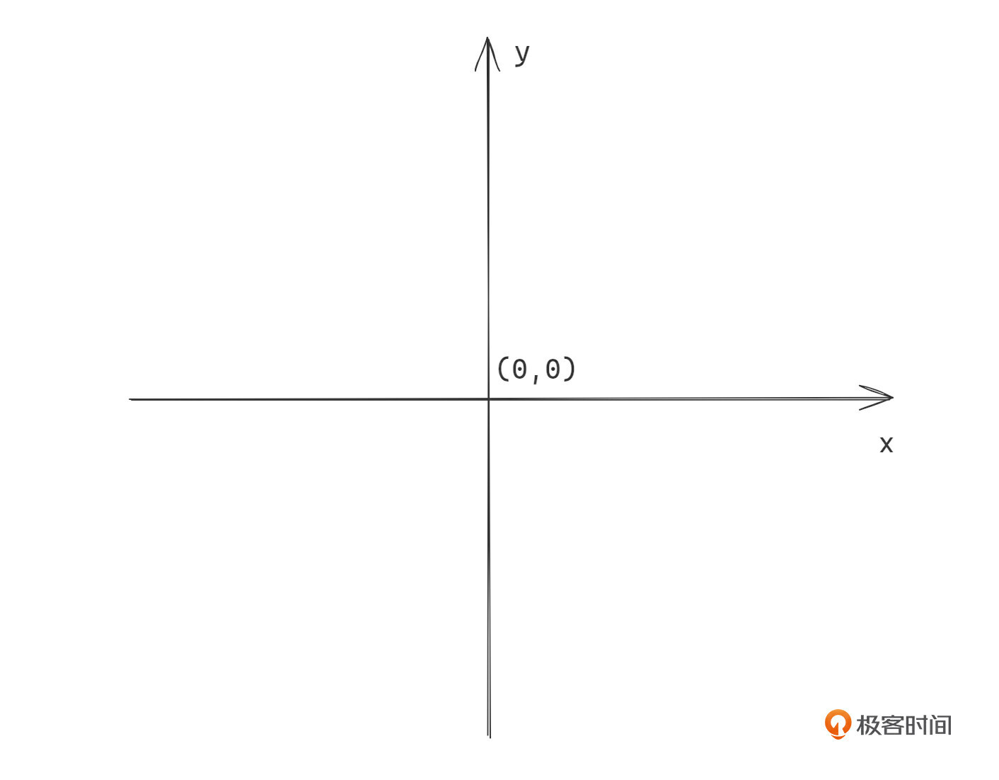

### 摄相机（Camera）

游戏引擎中都会有 Camera 的概念，3D 游戏的画面渲染严重依赖于 Camera。2D 游戏不太关心 Camera，但使用 Camera 也会有放大缩小的效果，默认 Bevy 的 Camera 在坐标系的 Z 轴上，也就是当前你眼睛所处的位置。

### 性能

借助于 ECS 范式，加上 Rust 强大的无畏并发能力，Bevy 能够让你的 systems 尽可能地运行在多个 CPU 核上，也就是并行运算。所以 Bevy 的基础性能是非常棒的，关于 benchmarks 的讨论，你可以看 [这里](https://github.com/bevyengine/bevy/discussions/655)。

有了这些基础知识的铺垫，我们下面进入实战环节吧。

## 实战贪吃蛇

这里我先给出完整代码的 [链接](https://github.com/miketang84/jikeshijian/tree/master/27-bevy_snake)，你最好下载下来边运行边对照下面的内容学习。

### 第 1 步：引入 Bevy 库

很简单，引入 Bevy 库，创建一个 App 实例。

```rust
use bevy::prelude::*;

fn main() {
    App::new().run();
}
```

这个程序运行后马上就结束了，没有任何输出，也没有窗口打开。

### 第 2 步：创建窗口

加入默认 Plugin 集合，里面有个主事件循环，还有个创建窗口的功能。然后我们需要设置 2D 的 Camera。

```rust
use bevy::prelude::*;

fn main() {
    App::new()
        .add_plugins(DefaultPlugins)
        .add_systems(Startup, setup_camera)
        .run();
}

fn setup_camera(mut commands: Commands) {
    commands.spawn(Camera2dBundle::default());
}
```

由于引擎本身是一个托管系统（带主循环的 Runtime），我们要在这个引擎所维护的世界状态里添加（或删除）新的东西，必须使用 Commands 这种任务指令形式。你可以把它想象成总线或消息队列编程模型。

这一步运行后，弹出一个窗口，并且渲染默认背景色。

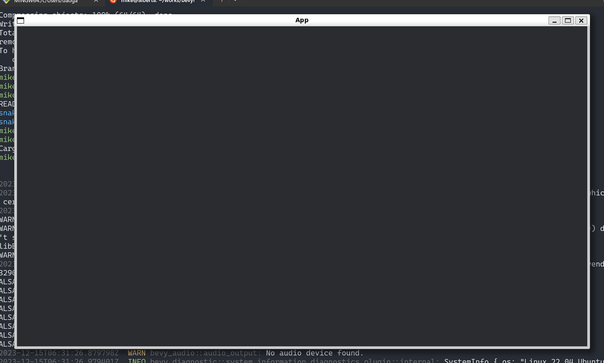

### 第 3 步：画出蛇的头

这一步我们添加一个新函数，创建蛇的头，然后用 add_systems 添加到 bevy runtime 中。你可以看一下代码发生的变化。

```rust
const SNAKE_HEAD_COLOR: Color = Color::rgb(0.7, 0.7, 0.7);

#[derive(Component)]
struct SnakeHead;

  //
  .add_systems(Startup, (setup_camera, spawn_snake))
  //

fn spawn_snake(mut commands: Commands) {
    commands
        .spawn(SpriteBundle {
            sprite: Sprite {
                color: SNAKE_HEAD_COLOR,
                ..default()
            },
            transform: Transform {
                scale: Vec3::new(10.0, 10.0, 10.0),
                ..default()
            },
            ..default()
        })
        .insert(SnakeHead);
}
```

我们用 struct 定义了 SnakeHead Component，它没有任何字段。没关系，目前一个类型名字符号就能表达我们的意思，当一个 tag 用。你继续往后面看。

你可以看到，一个 system 就是一个普通的 Rust 函数。SpriteBundle 是一个 Component Bundle，也就是组件包，可以把一组 components 组合在一起，SpriteBundle 里面就有 Sprite、Transform 等 components。Sprite 就是图片精灵的意思，是游戏里面表达角色的基本方法。Transform 抽象的是角色的运动，有位移、旋转和拉伸变换三种形式。

`spawn_snake() system` 目的就是创建这个蛇的头，它作为一个 entity 被插入到世界状态中。 `.insert(SnakeHead)` 把 SnakeHead 这个 Component 添加到这个刚创建好的 entity 上面。

`add_systems()` 中的第一个参数 Startup，用来表示这是游戏启动的时候执行的 systems。它们只执行一次，多个 systems 写在元组里面，更简洁。

你可以看一下这一步的运行效果，窗口中间出现了一个小方块，那就是蛇的头。

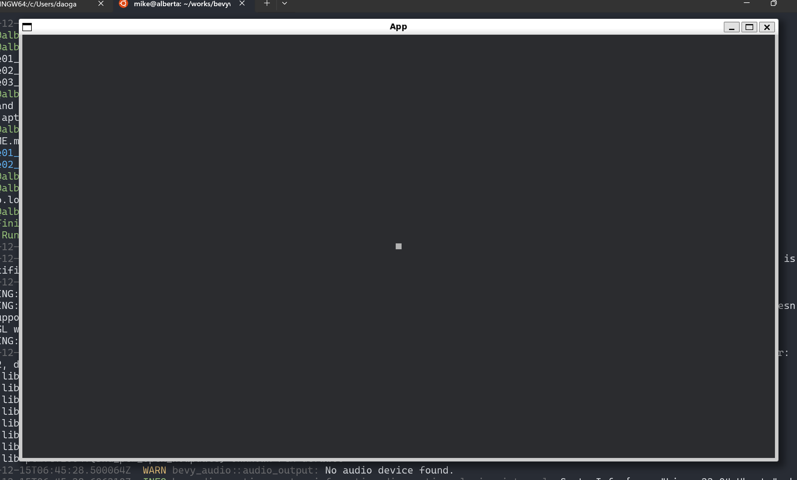

### 第 4 步：让这条蛇动起来

这里我给出这一步添加的代码，我们边看边解读。

```rust
.add_systems(Update, snake_movement)

fn snake_movement(mut head_positions: Query<(&SnakeHead, &mut Transform)>) {
    for (_head, mut transform) in head_positions.iter_mut() {
        transform.translation.y += 2.;
    }
}
```

这个 `snake_movement()` 就是处理蛇运动的 system，请注意参数

是 `Query<(&SnakeHead, &mut Transform)>` 类型，它的意思是从世界状态中去查找同时拥有 SnakeHead、Transform 两种 Components 的 entity，它定义了一个迭代器，并且 Transform 的实例还是可以修改的。遍历这个迭代器，其实目前只有一个 entity，更新负责管理它运动的 transform 实例。 `transform.translation.y += 2.` 就是纵向坐标向上移动 2 个像素。

`add_systems()` 的第一个参数 Update，表示这个 system 是运行在游戏运行过程中的，每一帧都需要更新一次（执行一次这个 system），也就是这个函数 1 秒会执行 60 次。

运行后你会发现这个小方块在自动向上移动，效果如下：

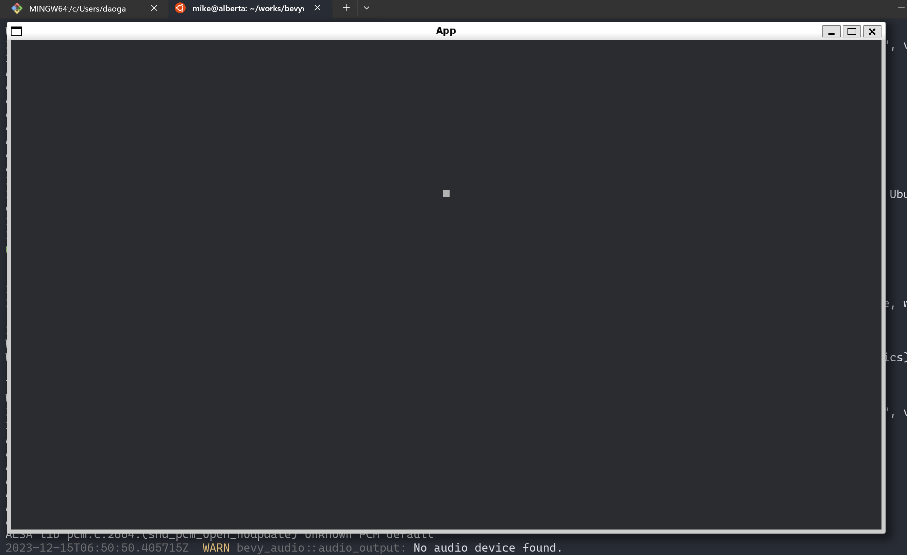

### 第 5 步：控制这条蛇的方向

下面我们需要控制蛇的方向，上下左右四个方向。这一步就是给 `snake_movement system` 填充内容。

```rust
fn snake_movement(
    keyboard_input: Res<Input<KeyCode>>,
    mut head_positions: Query<&mut Transform, With<SnakeHead>>,
) {
    for mut transform in head_positions.iter_mut() {
        if keyboard_input.pressed(KeyCode::Left) {
            transform.translation.x -= 2.;
        }
        if keyboard_input.pressed(KeyCode::Right) {
            transform.translation.x += 2.;
        }
        if keyboard_input.pressed(KeyCode::Down) {
            transform.translation.y -= 2.;
        }
        if keyboard_input.pressed(KeyCode::Up) {
            transform.translation.y += 2.;
        }
    }
}
```

`Input<KeyCode>` 是 Bevy 系统级的资源，用于表示输入设备，这里是键盘设备。要访问资源就在 system 里用 `Res<T>` 这种参数类型。 `keyboard_input.pressed()` 用于判断是否键盘按下了。

运行后，你就可以用方向键控制这个小方块的运动方向了。

### 第 6 步：将窗口网格化

默认 Bevy 的窗口坐标粒度是以屏幕的逻辑像素为单位的。而像贪吃蛇这种游戏，会将整个画布分成一个个正方形的小方格。具体怎么做，你可以看一下这一步变化的代码。

```rust
const ARENA_WIDTH: u32 = 10;
const ARENA_HEIGHT: u32 = 10;

#[derive(Component, Clone, Copy, PartialEq, Eq)]
struct Position {
    x: i32,
    y: i32,
}

#[derive(Component)]
struct Size {
    width: f32,
    height: f32,
}

impl Size {
    pub fn square(x: f32) -> Self {
        Self {
            width: x,
            height: x,
        }
    }
}

        //
        .add_systems(Update, (snake_movement, size_scaling, position_translation))

        //
        .insert(Position { x: 3, y: 3 })
        .insert(Size::square(0.8));
        //

// 计算方块元素的大小
fn size_scaling(primary_query: Query<&Window, With<bevy::window::PrimaryWindow>>, mut q: Query<(&Size, &mut Transform)>) {
    let window = primary_query.get_single().unwrap();
    for (sprite_size, mut transform) in q.iter_mut() {
        transform.scale = Vec3::new(
            sprite_size.width / ARENA_WIDTH as f32 * window.width() as f32,
            sprite_size.height / ARENA_HEIGHT as f32 * window.height() as f32,
            1.0,
        );
    }
}

// 计算位移
fn position_translation(primary_query: Query<&Window, With<bevy::window::PrimaryWindow>>, mut q: Query<(&Position, &mut Transform)>) {
    fn convert(pos: f32, bound_window: f32, bound_game: f32) -> f32 {
        let tile_size = bound_window / bound_game;
        pos / bound_game * bound_window - (bound_window / 2.) + (tile_size / 2.)
    }

    let window = primary_query.get_single().unwrap();
    for (pos, mut transform) in q.iter_mut() {
        transform.translation = Vec3::new(
            convert(pos.x as f32, window.width() as f32, ARENA_WIDTH as f32),
            convert(pos.y as f32, window.height() as f32, ARENA_HEIGHT as f32),
            0.0,
        );
    }
}
```

这一步，我们添加了 Position 和 Size 两种 Components。用来控制蛇头的逻辑位置和显示大小。新增了 `size_scaling` 和 `position_translation` 两个 system，用来在每一帧计算蛇头的尺寸和位置。

具体的算法理解上要注意的就是，坐标的原点是在窗口正中央，转换后的网格 grid 的坐标原点在窗口左下角。

你可以看一下这一步运行后的效果。

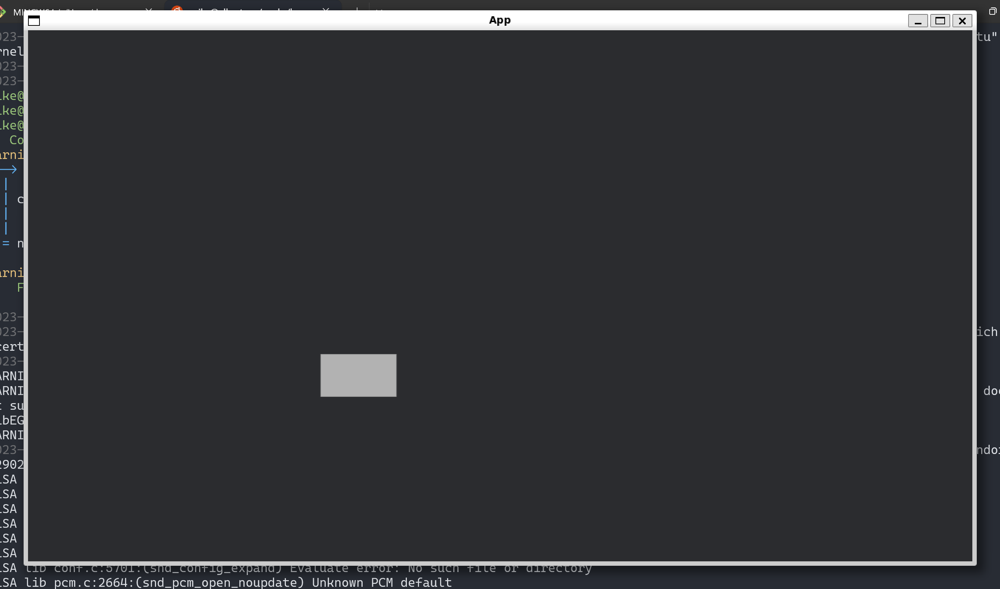

你可以看到，蛇的头的大小（为一个网格大小的 0.8）和位置已经变化了。这里的位置在 (3, 3)，网格总大小为 (10, 10)，左下角为 (0, 0)。

### 第 7 步：让蛇按网格移动

下面要让蛇的运动适配网格。你看一下这一步改动的代码。

```rust
fn snake_movement(
    keyboard_input: Res<Input<KeyCode>>,
    mut head_positions: Query<&mut Position, With<SnakeHead>>,
) {
    for mut pos in head_positions.iter_mut() {
        if keyboard_input.pressed(KeyCode::Left) {
            pos.x -= 1;
        }
        if keyboard_input.pressed(KeyCode::Right) {
            pos.x += 1;
        }
        if keyboard_input.pressed(KeyCode::Down) {
            pos.y -= 1;
        }
        if keyboard_input.pressed(KeyCode::Up) {
            pos.y += 1;
        }
    }
}
```

这一步我们要更新蛇头的逻辑坐标，也就是上一步定义那个 Position component 的实例。现在你可以通过方向键将这个小矩形块移动到其他位置。

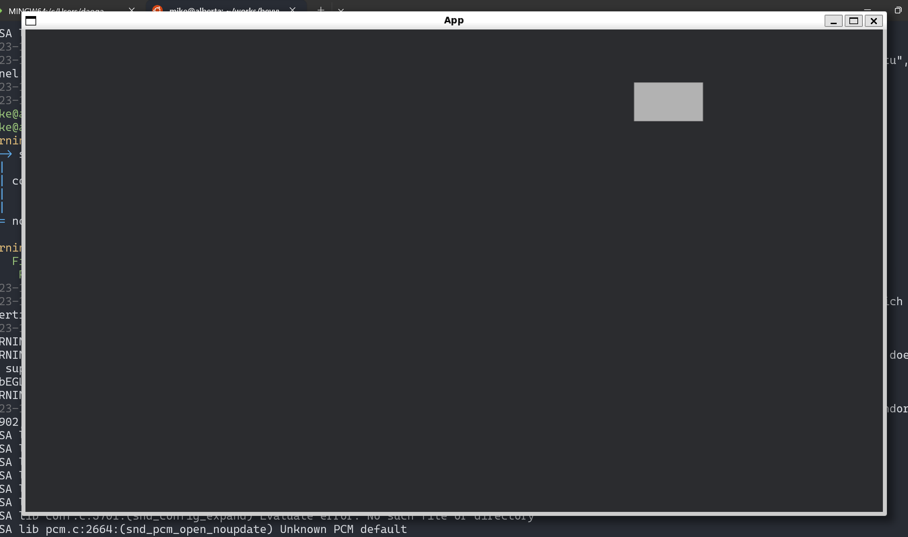

### 第 8 步：配置窗口比例和尺寸

默认打开的窗口是长方形的，我们要给它配置成方形。你可以看一下这一步的变化代码。

```rust
const ARENA_WIDTH: u32 = 25;
const ARENA_HEIGHT: u32 = 25;

        //
        .add_plugins(DefaultPlugins.set(WindowPlugin {
                primary_window: Some( Window {
                    title: "Snake!".to_string(),
                    resolution: bevy::window::WindowResolution::new( 500.0, 500.0 ),
                    ..default()
                }),
                ..default()
            })
        )
        .insert_resource(ClearColor(Color::rgb(0.04, 0.04, 0.04)))
        //
```

这一步我们做了 4 件事情。

1. 设置窗口尺寸为 500px x 500px。
2. 设置窗口标题为 Snake!。
3. 设置窗口填充背景颜色为 Color::rgb(0.04, 0.04, 0.04)。
4. 分割窗口 grid 为更大一点的数字，比如 25x25。

你看一下这一步的效果。

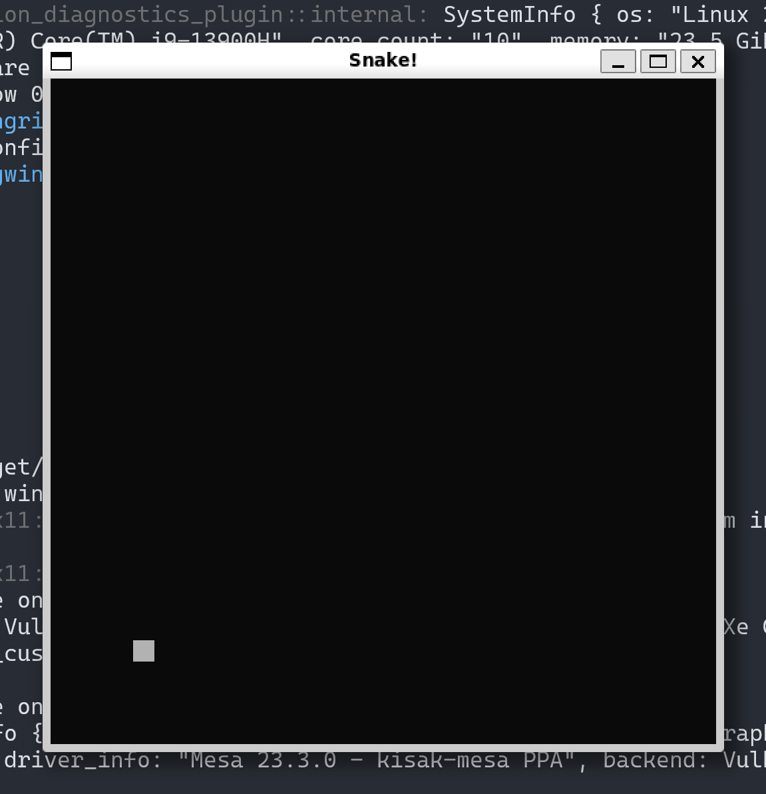

离我们期望的样子越来越近了。

### 第 9 步：随机产生食物

下面要开始产生食物。食物我们也用另一种小方块来表示。你看一下这一步变化的代码。

```rust
const FOOD_COLOR: Color = Color::rgb(1.0, 0.0, 1.0);

#[derive(Component)]
struct Food;

        .add_systems(Update, food_spawner)

fn food_spawner(mut commands: Commands) {
    commands
        .spawn(SpriteBundle {
            sprite: Sprite {
                color: FOOD_COLOR,
                ..default()
            },
            ..default()
        })
        .insert(Food)
        .insert(Position {
            x: (random::<f32>() * ARENA_WIDTH as f32) as i32,
            y: (random::<f32>() * ARENA_HEIGHT as f32) as i32,
        })
        .insert(Size::square(0.8));
}
```

食物随机产生，所以需要用到 random 函数。同样，我们定义了 Food 这个 Compoment，然后定义了 food_spawner system，并添加到 runtime 中去。创建的食物 entity 上带有 Sprite、Food、Position、Size 等 components。

可以想象，这个创建食物的 system1 秒会执行 60 次，也就是 1 秒钟会创建 60 个食物，速度太快了。

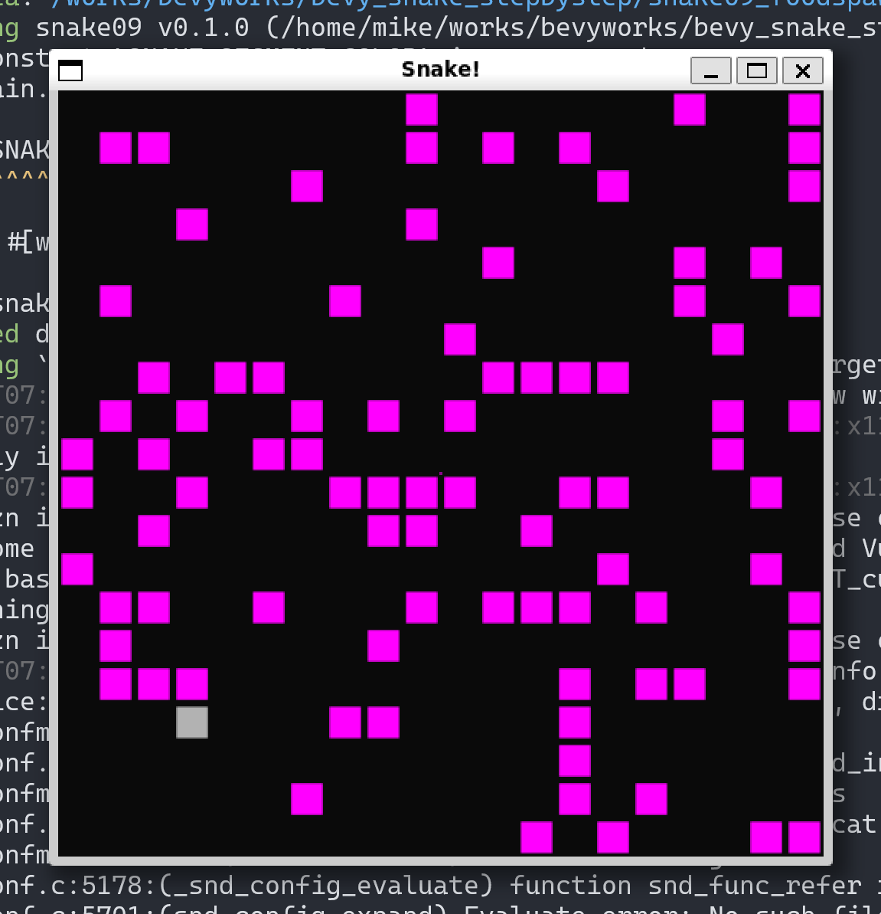

### 第 10 步：使用定时器产生食物

下面我们要控制食物的产生速度，比如 2 秒产生一颗食物。我们来看这一步变化的代码。

```rust
#[derive(Resource)]
struct FoodSpawnTimer(Timer);

        .insert_resource(FoodSpawnTimer(Timer::from_seconds(
            1.0,
            TimerMode::Repeating,
        )))

fn food_spawner(
    mut commands: Commands,
    time: Res<Time>,
    mut timer: ResMut<FoodSpawnTimer>,
    ) {
    // 如果时间未到 2s 就立即返回
    if !timer.0.tick(time.delta()).finished() {
        return;
    }
    commands
        .spawn(SpriteBundle {
            sprite: Sprite {
                color: FOOD_COLOR,
                ..default()
            },
            ..default()
        })
        .insert(Food)
        .insert(Position {
            x: (random::<f32>() * ARENA_WIDTH as f32) as i32,
            y: (random::<f32>() * ARENA_HEIGHT as f32) as i32,
        })
        .insert(Size::square(0.8));
}
```

Timer 类型是 Bevy 提供的定时器类型，我们用 newtype 模式定义一个自己的定时器，它是一种资源（全局唯一）。我们使用 `insert_resource()` 将这个资源初始化并插入到托管系统中去。

然后在 `food_spawner system` 中使用 `ResMut<FoodSpawnTimer>` 这种形式来使用资源。同时用 `Res<Time>` 这种形式来获取游戏中的时间，这个也是 Bevy 引擎提供的。细心的你可能发现了，Bevy 采用的也是声明式参数实现，和前面课程讲到的 Axum 风格一样。这些参数顺序是可以变的！在这里你可以体会到 Rust 强大的表达能力。

我们再来看一句。

```rust
    if !timer.0.tick(time.delta()).finished() {
        return;
    }
```

这一句表示每次执行这个 `food_spawner system`（1 秒执行 60 次）时，先判断当前流逝了多少时间，如果定时器的一次间隔还没到，就直接返回，不执行这个函数后面的部分，也就不产生一个食物了。这样就实现了控制食物产生速率的目的。

你可以看一下运行效果。

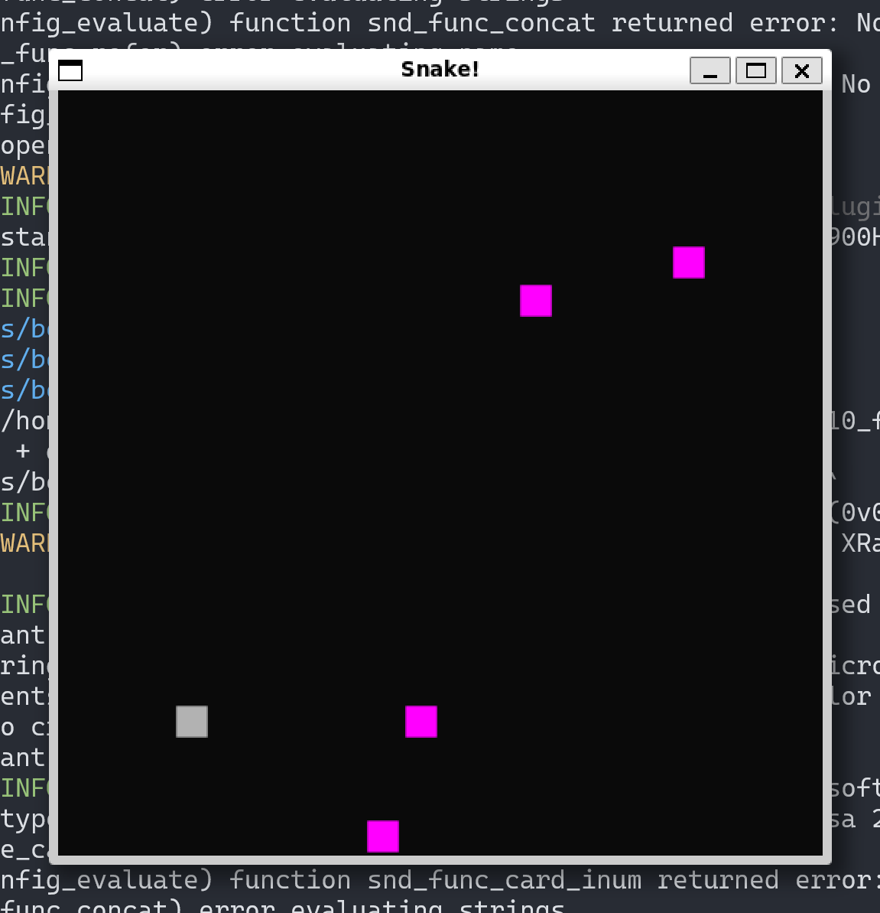

现在 2 秒产生一颗食物，速度比刚才慢多了。

### 第 11 步：让蛇自动前进

下面我们要让蛇自己动起来，而且也要控制它的运动速率。同样的我们会用定时器方法。

你来看这一步改动的代码。

```rust
#[derive(Resource)]
struct BTimer(Timer);

#[derive(Component)]
struct SnakeHead {
    direction: Direction,
}

#[derive(PartialEq, Copy, Clone)]
enum Direction {
    Left,
    Up,
    Right,
    Down,
}

impl Direction {
    fn opposite(self) -> Self {
        match self {
            Self::Left => Self::Right,
            Self::Right => Self::Left,
            Self::Up => Self::Down,
            Self::Down => Self::Up,
        }
    }
}
        // 插入定时器资源
        .insert_resource(BTimer(Timer::from_seconds(
            0.20,
            TimerMode::Repeating,
        )))
        // 更新Update模式下的system集
        .add_systems(Update, (
            snake_movement_input.before(snake_movement),
            snake_movement,
            size_scaling,
            position_translation))

// 根据用户键盘行为，预处理蛇的前进方向
fn snake_movement_input(
    keyboard_input: Res<Input<KeyCode>>,
    mut heads: Query<&mut SnakeHead>) {
    if let Some(mut head) = heads.iter_mut().next() {
        let dir: Direction = if keyboard_input.just_pressed(KeyCode::Left) {
            Direction::Left
        } else if keyboard_input.just_pressed(KeyCode::Down) {
            Direction::Down
        } else if keyboard_input.just_pressed(KeyCode::Up) {
            Direction::Up
        } else if keyboard_input.just_pressed(KeyCode::Right) {
            Direction::Right
        } else {
            head.direction
        };
        if dir != head.direction.opposite() {
            head.direction = dir;
        }
    }
}

// 蛇的运动system
fn snake_movement(
    mut heads: Query<(&mut Position, &SnakeHead)>,
    time: Res<Time>,
    mut timer: ResMut<BTimer>,
) {
    // 如果时间未到 0.2s 就立即返回
    if !timer.0.tick(time.delta()).finished() {
        return;
    }

    if let Some((mut head_pos, head)) = heads.iter_mut().next() {
        match &head.direction {
            Direction::Left => {
                head_pos.x -= 1;
            }
            Direction::Right => {
                head_pos.x += 1;
            }
            Direction::Up => {
                head_pos.y += 1;
            }
            Direction::Down => {
                head_pos.y -= 1;
            }
        };
    }
}
```

类似地，我们定义了 BTimer 来控制蛇的自动行走，0.2 秒走一格。同时，我们现在可以给蛇指定行走的方向了，因此新定义了 Direction 枚举，并在 SnakeHead Component 里添加了 direction 字段。

代码中的 `snake_movement_input.before(snake_movement)` 表示明确指定 `snake_movement_input` 在 `snake_movement system` 之前处理。因为 bevy 默认会尽可能并行化，所以这样指定能够明确 system 的执行顺序，不然可能是乱序执行的。

### 第 12 步：定义蛇身

下面是定义蛇的身子，这是整个模型相对困难的一步。但其实把结构定义好了就会很简单。

你可以看一下这步变化的代码。

```rust
#[derive(Component)]
struct SnakeSegment;

#[derive(Resource, Default, Deref, DerefMut)]
struct SnakeSegments(Vec<Entity>);

    // 插入蛇的结构，定义为资源
    .insert_resource(SnakeSegments::default())

// 创建蛇，用SnakeSegments来维护蛇的结构
fn spawn_snake(mut commands: Commands, mut segments: ResMut<SnakeSegments>) {
    *segments = SnakeSegments(vec![
        commands
            .spawn(SpriteBundle {
                sprite: Sprite {
                    color: SNAKE_HEAD_COLOR,
                    ..default()
                },
                ..default()
            })
            .insert(SnakeHead {
                direction: Direction::Up,
            })
            .insert(SnakeSegment)
            .insert(Position { x: 3, y: 3 })
            .insert(Size::square(0.8))
            .id(),
        spawn_segment(commands, Position { x: 3, y: 2 }),
    ]);
}

// 创建蛇的一个segment，也就是一个小方块
fn spawn_segment(mut commands: Commands, position: Position) -> Entity {
    commands
        .spawn(SpriteBundle {
            sprite: Sprite {
                color: SNAKE_SEGMENT_COLOR,
                ..default()
            },
            ..default()
        })
        .insert(SnakeSegment)
        .insert(position)
        .insert(Size::square(0.65))
        .id()
}
```

这里，最关键的是定义了 SnakeSegment Component 和 `SnakeSegments(Vec<Entity>)` 这个 Resource。我们把蛇的头和每一节身子小方块都视为一个 SnakeSegment，整条蛇由多个 SnakeSegment 组成，因此用 `SnakeSegments(Vec<Entity>)` 这个资源来维护这条蛇的结构。 `SnakeSegments(Vec<Entity>)` 里面需要存下每个 SnakeSegment 的 Entity id。

默认开始的时候，蛇有一节身子，位置在 (3, 2)。蛇的运动方向是向上的。蛇身小方块是 0.65 个网格单元大小。

你可以看一下这一步运行后的效果。

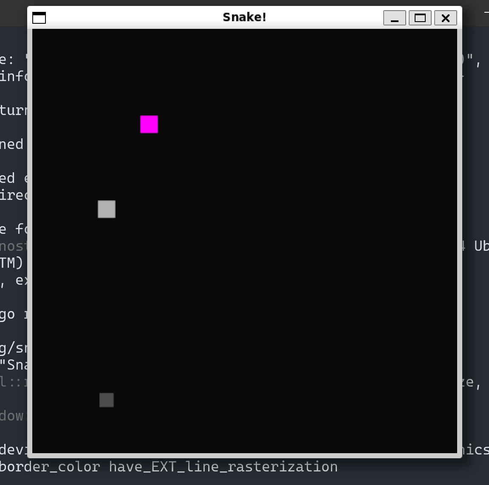

可以看到，这一节蛇身没有跟着头一起动。

### 第 13 步：让蛇身跟着蛇的头一起运动

让蛇身跟着蛇头一起动，模型上其实就是让蛇身的每一节跟着蛇头的移动一起变换坐标就行了。我们看一下这一步的代码变化。

```rust
fn snake_movement(
    time: Res<Time>,
    mut timer: ResMut<BTimer>,
    segments: ResMut<SnakeSegments>,
    mut heads: Query<(Entity, &SnakeHead)>,
    mut positions: Query<&mut Position>,
) {
    // 不到0.2s立即返回
    if !timer.0.tick(time.delta()).finished() {
        return;
    }

    if let Some((head_entity, head)) = heads.iter_mut().next() {
        let segment_positions = segments
            .iter()
            .map(|e| *positions.get_mut(*e).unwrap())
            .collect::<Vec<Position>>();
        // 处理蛇的头的位移
        let mut head_pos = positions.get_mut(head_entity).unwrap();
        match &head.direction {
            Direction::Left => {
                head_pos.x -= 1;
            }
            Direction::Right => {
                head_pos.x += 1;
            }
            Direction::Up => {
                head_pos.y += 1;
            }
            Direction::Down => {
                head_pos.y -= 1;
            }
        };
        // 处理蛇身每一段的位置变化
        segment_positions
            .iter()
            .zip(segments.iter().skip(1))
            .for_each(|(pos, segment)| {
                *positions.get_mut(*segment).unwrap() = *pos;
            });
    }
}
```

这个算法的精华在这一句：

```rust
        segment_positions
            .iter()
            .zip(segments.iter().skip(1))
            .for_each(|(pos, segment)| {
                *positions.get_mut(*segment).unwrap() = *pos;
            });
```

意思就是，当蛇动一步的时候，第一节蛇身的坐标值填充蛇头的坐标值，第二节蛇身的坐标值填充第一节蛇身的坐标值，以此类推，直到遍历完整个蛇身。

可以看到，Rust 可以把问题表达得相当精练。

你看一下这一步运行后的效果。

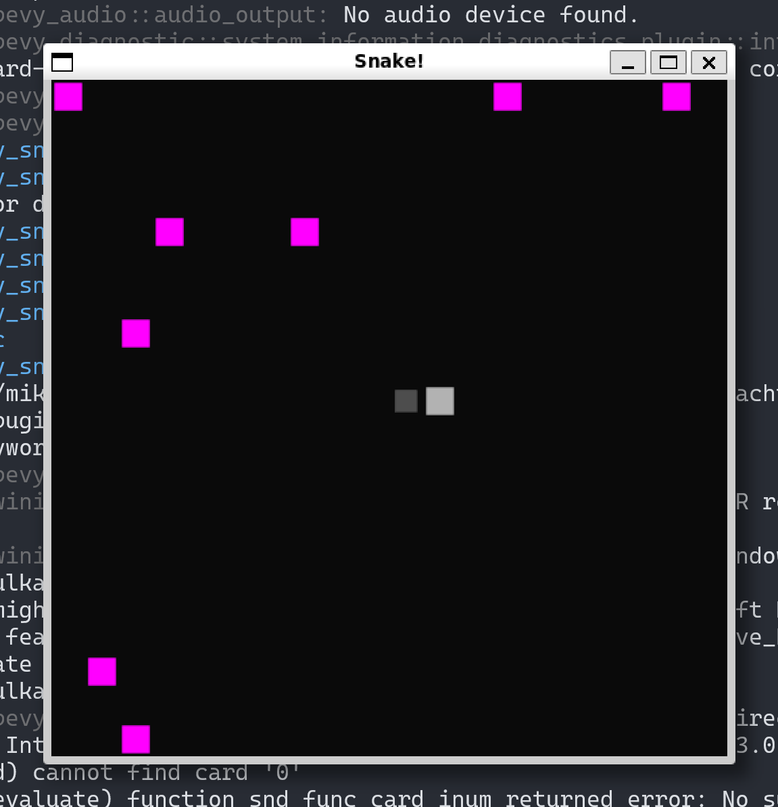

### 第 14 步：边吃边长大

下面就该处理吃食物并长大的效果了。吃食物的原理就是当蛇头占据了那个食物的位置时，就在系统中注销掉那个食物，然后在蛇身的尾巴位置处添加一个小方块。

你看一下这一步变化的代码。

```rust
#[derive(Event)]
struct GrowthEvent;

#[derive(Default, Resource)]
struct LastTailPosition(Option<Position>);

        // 更新Update system集合
        .add_systems(Update, (
            snake_movement_input.before(snake_movement),
            snake_movement,
            snake_eating,
            snake_growth,
            size_scaling,
            position_translation))

    *last_tail_position = LastTailPosition(Some(*segment_positions.last().unwrap()));

// 处理蛇吃食物的system
fn snake_eating(
    mut commands: Commands,
    mut growth_writer: EventWriter<GrowthEvent>,
    food_positions: Query<(Entity, &Position), With<Food>>,
    head_positions: Query<&Position, With<SnakeHead>>,
) {
    for head_pos in head_positions.iter() {
        for (ent, food_pos) in food_positions.iter() {
            // 通过遍历来判断有没有吃到一个食物
            if food_pos == head_pos {
                commands.entity(ent).despawn();
                growth_writer.send(GrowthEvent);
            }
        }
    }
}

// 处理蛇长大的system
fn snake_growth(
    commands: Commands,
    last_tail_position: Res<LastTailPosition>,
    mut segments: ResMut<SnakeSegments>,
    mut growth_reader: EventReader<GrowthEvent>,
) {
    // 通过事件机制来解耦蛇长大的逻辑
    if growth_reader.read().next().is_some() {
        segments.push(spawn_segment(commands, last_tail_position.0.unwrap()));
    }
}
```

我们添加了 `LastTailPosition(Option<Position>)` 这个蛇尾的位置坐标作为资源来实时更新，好知道蛇长长的时候，应该在哪个位置添加 segment。然后新增了 `snake_eating` 和 `snake_growth` 两个 system。

我们新定义了 GrowthEvent 长大的事件。

`snake_eating system` 处理吃食物的业务，就是当蛇头的位置与食物位置重合时，就调用 `commands.entity(ent).despawn()` 将食物给注销掉。然后用 `growth_writer.send(GrowthEvent)` 向系统总线发送一个“长大”的事件。

`snake_growth system` 处理蛇长大的业务，通过 `EventReader<GrowthEvent>` 定义的 growth_reader，读取系统中的长大事件，使用 `spawn_segment()` 和 `segments.push()` 把尾巴添加到蛇的全局维护资源中去。

`snake_eating` 和 `snake_growth` 在每一帧更新时都会执行。

可以看到，通过这样的事件总线，Bevy 系统把业务解耦得相当漂亮。每个 system 就专注于处理一件“小”事情就行了。这样对于构建复杂的游戏系统来说，大大减轻了我们的心智负担。

你可以看一下这一步执行后的效果。

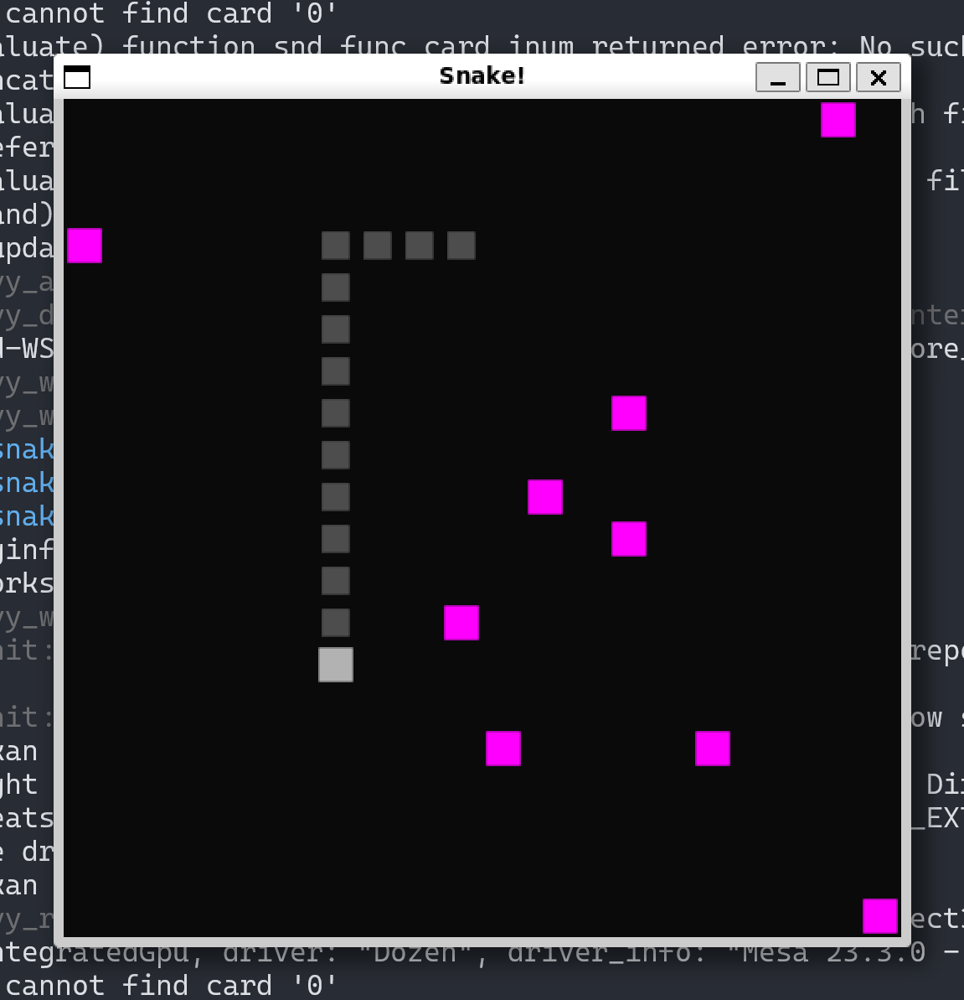

### 第 15 步：撞墙和自身 Game Over

好了，我们的贪吃蛇的主体功能基本实现好了，下面需要加入撞墙和撞自身死的判断。你看一下这一步变化的代码。

```rust
#[derive(Event)]
struct GameOverEvent;
        // 注册事件到world中
        .add_event::<GameOverEvent>()
        .add_systems(Update, (
            snake_movement_input.before(snake_movement),
            snake_movement,
            game_over.after(snake_movement),
            snake_eating,
            snake_growth,
            size_scaling,
            position_translation))

        // 判断撞墙的逻辑
        if head_pos.x < 0
            || head_pos.y < 0
            || head_pos.x as u32 >= ARENA_WIDTH
            || head_pos.y as u32 >= ARENA_HEIGHT
        {
            game_over_writer.send(GameOverEvent);
        }
        // 判断撞自己身子的逻辑
        if segment_positions.contains(&head_pos) {
            game_over_writer.send(GameOverEvent);
        }
        //

// game over 子system
fn game_over(
    mut commands: Commands,
    mut reader: EventReader<GameOverEvent>,
    segments_res: ResMut<SnakeSegments>,
    food: Query<Entity, With<Food>>,
    segments: Query<Entity, With<SnakeSegment>>,
) {
    if reader.read().next().is_some() {
        for ent in food.iter().chain(segments.iter()) {
            commands.entity(ent).despawn();
        }
        spawn_snake(commands, segments_res);
    }
}
```

撞墙这个只需要判断有没有超出 grid 边界就可以了。撞自身判断用 `segment_positions.contains(&head_pos)` 看所有蛇身的 segment 的 position Vec 里有没有包含蛇头的位置。

我们添加了 `GameOverEvent` 事件和 `game_over system`，也是用的异步事件的方式。当收到 `GameOverEvent` 的时候，把所有的蛇的 entity 和食物的 entity 全部清理（despawn）掉。注意这里用了两个迭代器的 `.chain()` 方法，让清理工作表达得更紧凑，你可以体会一下。

清理完后，再重新创建蛇，游戏重新开始。到这一步，游戏已经基本能玩了，还写什么代码，先玩几把吧。

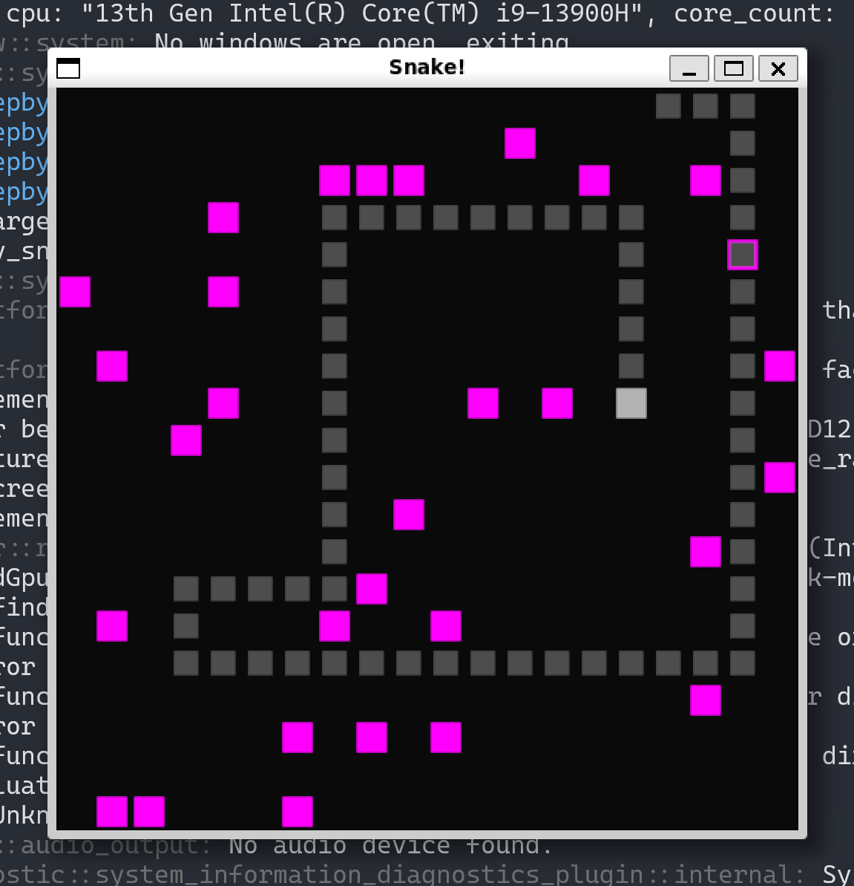

目前为止，整个代码不过 330 行左右。

## 小结

这节课我们通过自己动手编写一个贪吃蛇小游戏，学习了 Rust 游戏开发引擎 Bevy 的基本使用方式。Bevy 游戏引擎充分利用 Rust 语言的无忧并发和强大的表达能力，让开发游戏变得跟游戏一样好玩。整个过程下来，心情愉快、舒畅。你可以跟着我一步一步敲代码，体会这种感觉。

Bevy 的核心是一套 ECS 系统，ECS 本质上来说是一套编程范式，不仅限于在游戏中使用，它也可以在其他的业务系统中使用。你有必要多花点时间查阅相关资料去理解它。后面有机会我也会继续出相关的研究内容。

写 Bevy 代码的时候，我们要理解 Bevy 是一种 Runtime，我们写的代码实际会被这个 Runtime 托管运行。我们要做的就是按照 ECS 规范定义 Component、Resource、Event 等，实现 system 添加到这个 Runtime 中。底层那些脏活累活 Bevy 全帮我们做了，我们只需要专心抽象模型、定义结构、处理业务。

然后，通过这节课的内容我们可以体会到，写小游戏其实也是一种相当好的建模能力的训练，我们可以通过这种有趣的方法提升自己在这方面的能力。

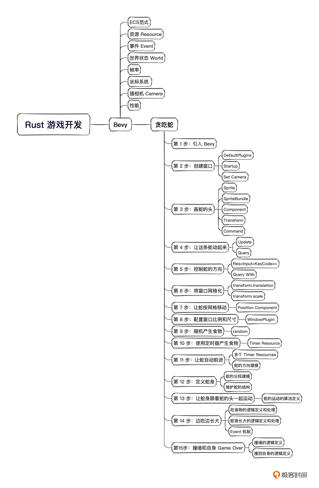

本讲源代码： [https://github.com/miketang84/jikeshijian/tree/master/27-bevy_snake](https://github.com/miketang84/jikeshijian/tree/master/27-bevy_snake)

必读的两个 Bevy 资料：

- [https://bevyengine.org/learn/book/introduction/](https://bevyengine.org/learn/book/introduction/)
- [https://bevy-cheatbook.github.io/introduction.html](https://bevy-cheatbook.github.io/introduction.html)

## 思考题

这节课的代码还有个问题，就是食物有可能在已经产生过的地方产生，也有可能在蛇身上产生，请问如何处理这个 Bug？欢迎你把你的处理思路和实现代码分享出来，我们一起探讨，如果你觉得这节课对你有帮助的话，也欢迎你把这节课的内容分享给其他朋友，我们下节课再见！
