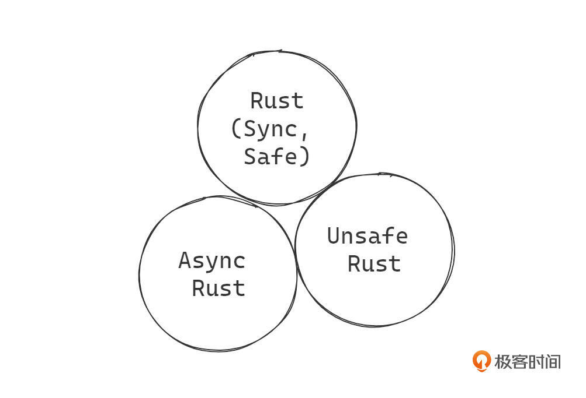
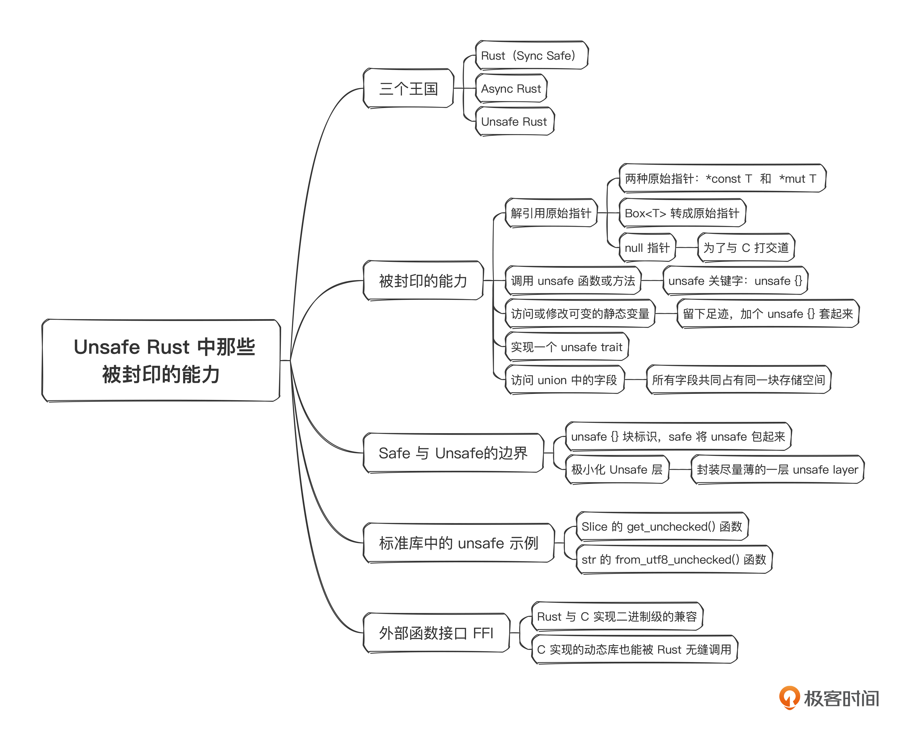

# 29 ｜ Unsafe 编程（上）： Unsafe Rust 中那些被封印的能力

你好，我是 Mike。

这门课目前已接近尾声，剩下的两节课我准备讲讲 Rust 中看起来有点黑魔法的部分——Unsafe Rust。这一节课我们先来聊聊相关的概念。

在前面课程的学习中，你有没有感觉到，Rust 编译器就像是一个严厉的大师傅，或者一个贴心的小助手，在你身边陪你结对编程，你写代码的时候，他盯着屏幕，时不时提醒你。如果某个时刻，这个大师傅或小助手突然离开了，你会不会慌？就像刚提车，第一次独自上路的那种感觉。

## 三个王国

Unsafe Rust 就是这样一个领域，进入这个领域，你突然拥有了几种必杀技能，但是身边已经没有大师傅同行了，只能靠你自己完全控制这几种技能的使用。使用得好，威力无穷。使用不好，对自己也会造成巨大伤害。Unsafe Rust 就是这样一个相对独立的领域。前面我们讲到过，Async Rust 也是相对独立的一个附属王国，现在又多了一个 Unsafe Rust 这样的附属王国。



Rust 语言可以看作是这三块疆域的合体，它们共同组成了一个联盟 Rust 王国。你甚至可以把 Rust 语言看成包含上面三种编程语言的一种混合语言。所以很多人抱怨 Rust 难学，也是可以理解的。

现在让我们把注意力集中在 Unsafe Rust 这个王国里面。它到底是什么样的？简单地说，你可以把它理解成这个王国里面住着一个 C 语言族的国王。也就是说，C 语言能做的事情，Unsafe Rust 都能做。C 语言能做哪些事情呢？理论上来说，它能做计算机中的任何事情。因此，在 Unsafe Rust 中，你也能做计算机中的任何事情。C 的强大威力来源于它锋利的指针，而在 Unsafe Rust 中也提供了这种能力。

## 被封印的能力

Safe Rust 王国有些技能被封印了，而这些技能进入到 Unsafe Rust 王国后，就可以被揭开使用。具体来说，有 5 种技能。

1. 解引用原始指针
2. 调用 unsafe 函数或方法
3. 访问或修改可变的静态变量
4. 实现一个 unsafe trait
5. 访问 union 中的字段

这里我们简单提一下这 5 个方面，我们从第 5 点讲起。union 我们在课程里没有讲，这里我们简单了解下。它是一个类似于 C 中 union 的设计，也就是所有字段共同占有同一块存储空间。访问它的字段时，需要在 Unsafe Rust 中使用。

```rust
union IntOrFloat {
    i: u32,
    f: f32,
}
let mut u = IntOrFloat { f: 1.0 };
// 读取union字段时需要用 unsafe {} 包起来
assert_eq!(unsafe { u.i }, 1065353216);
// 更新了i，结果f字段的值也变化了。
u.i = 1073741824;
assert_eq!(unsafe { u.f }, 2.0);
```

我们一般用不到 union，如果需要深入研究，可以查看我给出的 [链接](https://doc.rust-lang.org/std/keyword.union.html)。

第 4 点，我们可以给 trait 实现 unsafe，这块内容比较深，所以在我们这门初级课程里不要求了解，如果你有兴趣可以查看我给出的 [链接](https://doc.rust-lang.org/nomicon/safe-unsafe-meaning.html)。

第 3 点也就是全局静态变量，前面我不提倡修改它，因为它是一种不太好的编程模型。但是如果你非要改的话，也是有办法的，那就留下足迹，加个 `unsafe {}` 套起来，比如 the book 里的 [示例](https://doc.rust-lang.org/book/ch19-01-unsafe-rust.html#accessing-or-modifying-a-mutable-static-variable)。

```rust
// 这里修饰为 mut
static mut COUNTER: u32 = 0;
fn add_to_count(inc: u32) {
    // 修改全局可变静态变量需要用 unsafe
    unsafe {
        COUNTER += inc;
    }
}
fn main() {
    add_to_count(3);
    // 访问全局可变静态变量也需要用 unsafe
    unsafe {
        println!("COUNTER: {}", COUNTER);
    }
}
// 输出
COUNTER: 3
```

下面我来重点讲解一下前 2 种场景。

### unsafe 关键字

Rust 中有一个 unsafe 关键字，用来显式地标明我们要进入 unsafe Rust 的领地。unsafe 关键字可以修饰 fn、trait，还可以在后面跟一个 {} 表明这是一个 unsafe 块，把可能不安全的逻辑包起来，像下面这样：

```rust
unsafe {
    //...
}
```

这里，需要说明一下，被 unsafe 标识或包起来的代码，并不是说一定有问题。它的准确意思是： **Rustc 编译器不保证被 unsafe 标识的代码是安全的，你应该保证你写的代码是安全的**。

也就是说，unsafe 这个标识符，在代码中留下了明确的足迹，将交由 Rustc 全权保证安全的代码，和不交由 Rustc 全权保证安全的代码，分隔开了。

请注意上面这句话的用词，“不交由 Rustc 全权保证安全的代码部分”并不是说 Rustc 编译器就完全不检查 unsafe 里的代码了，实际 Rustc 只是对上面提到的 5 种技能不加检查。对于 Safe Rust 里的内容还是要做检查，跟之前一样。我们来看一个示例。

```rust
fn main() {
    let v = [1,2,3];

    unsafe {
        println!("COUNTER: {}", v[3]);
    }
}
// 编译输出
warning: unnecessary `unsafe` block
 --> src/main.rs:4:5
  |
4 |     unsafe {
  |     ^^^^^^ unnecessary `unsafe` block
  |
  = note: `#[warn(unused_unsafe)]` on by default

error: this operation will panic at runtime
 --> src/main.rs:5:33
  |
5 |         println!("COUNTER: {}", v[3]);
  |                                 ^^^^ index out of bounds: the length is 3 but the index is 3
```

示例中，我们需要重点关注 array 的下标索引越界的问题。我们在 [第 1 讲](https://time.geekbang.org/column/article/718865) 里已经讲过，array 的下标索引越界会在编译期被检查出来，可以看到，即使放在 unsafe block 中，它仍然执行了检查。这印证了我们上面的说法： **被 unsafe 标识的代码，并不是让 Rustc 完全不管，而只是某几种技能让 Rustc 不管**。Safe Rust 中的那些元素，Rustc 该管的还是要管。

所以即使是 Unsafe Rust，看上去也要比写 C 代码来得“安全”，犯错的风险更小一些。另外编译器指出这里 unsafe 块没什么用，可以去掉，我们确实没使用它。

### 原始指针

Rust 中有两种原始指针（raw pointer）， `*const T` 和 `*mut T`。用法如下：

```rust
fn main() {
    let my_num: i32 = 10;
    let my_num_ptr: *const i32 = &my_num;
    let mut my_speed: i32 = 88;
    let my_speed_ptr: *mut i32 = &mut my_speed;

    unsafe {
        println!("my_num is: {}", *my_num_ptr);
        println!("my_speed is: {}", *my_speed_ptr);
    }
}
// 输出
my_num is: 10
my_speed is: 88
```

也就是可以将不可变引用 `&T` 转换成 `*const T` 指针。将可变引用 `&mut T` 转换成 `*mut T` 指针。你也可以用 [as 操作符](https://doc.rust-lang.org/book/ch19-01-unsafe-rust.html#dereferencing-a-raw-pointer) 来转换。

之前我们讲过，引用是必须有效的指针，而指针不一定是引用，在这里就得到了充分的体现。原始指针指向的数据不对的话，解引用有可能会导致段错误或其他未定义行为。因此引用转换为原始指针的时候，不需要包 unsafe，解引用原始指针的时候，要用 unsafe 包起来。这就是我们上面说的那 5 种被封印的能力中的第一种能力： **在 unsafe Rust 中，可以解引用原始指针。**

一旦接触到了原始指针，也就开启了计算机底层系统的大门。你可以看我放在这里的两个链接，感受一下原始指针的复杂性。

- [https://doc.rust-lang.org/std/primitive.pointer.html](https://doc.rust-lang.org/std/primitive.pointer.html)
- [https://doc.rust-lang.org/std/ptr/index.html](https://doc.rust-lang.org/std/ptr/index.html)

### `Box<T>` 转成原始指针

`Box<T>` 是带所有权的智能指针，它有一个 `into_raw()` 函数可以转换成原始指针。这个转换对于内存里的资源没有影响。但是要再从 raw pointer 转回 Box 就要放在 unsafe 里包起来， `Box::from_raw()` 是 unsafe 的。

```rust
fn main() {
    let my_speed: Box<i32> = Box::new(88);
    let my_speed: *mut i32 = Box::into_raw(my_speed);

    unsafe {
        let _ = Box::from_raw(my_speed);
    }
}
```

这实际上也是对原始指针解引用的一个变形，所以要放在 unsafe 块里。

### null 指针

之前我们说过，Rust 中不存在 null/nil 值，所有的变量都必须初始化。这在 Safe Rust 里是正确的。但是在 Unsafe Rust 中，却提供了 null 指针的表示。

可以用 std::ptr 里的 `null()` 和 `null_mut()` 生成两种原始空指针。

```rust
fn main() {
    use std::ptr;

    let p: *const i32 = ptr::null();
    assert!(p.is_null());
    let p: *mut i32 = ptr::null_mut();
    assert!(p.is_null());
}
```

Rust 中为什么会有空指针存在？有什么作用呢？那是因为 C 语言中有空指针这个东西。为了与 C 打交道，Rust 中要有对应的设计，好与 C 库或者 C 应用程序对接，毕竟在 Rust 出来之前，C/C++ 已经建成了这个软件世界的地基。

### Safe 与 Unsafe 的边界

在 Rust 中，unsafe 函数必须在 unsafe 函数中调用，或使用 `unsafe {}` 块包起来调用。因此下面的代码是可以的：

```rust
fn foo() {
    let my_num_ptr = &10 as *const i32;
    let my_speed_ptr = &mut 88 as *mut i32;

    unsafe {
        println!("my_num is: {}", *my_num_ptr);
        println!("my_speed is: {}", *my_speed_ptr);
    }
}

fn main() {
    foo();
}
```

可以看到， `foo()` 函数中包含了 unsafe 块的调用。但是从 `main()` 函数的角度来看，它调用 `foo()` 时不需要在外面再套一层 `unsafe {}` 来调用了。这里实际体现了重要的一点， **Unsafe 与 Safe 的边界**。示例代码里两者的边界就在 `foo()` 函数中。

从 `main()` 的视角来看，它调用的 `foo()` 有可能是第三方库暴露出来的接口，并不知道里面具体的实现，只知道这个函数可以按 Safe Rust 的形式安全调用。这里的这个 `foo()` 就是 **对 unsafe 代码的 safe 封装**。

我们再来看一个实际一点的例子。

```rust
use std::slice;
fn split_at_mut(values: &mut [i32], mid: usize) -> (&mut [i32], &mut [i32]) {
    let len = values.len();
    let ptr = values.as_mut_ptr();
    assert!(mid <= len);
    unsafe {
        (
            slice::from_raw_parts_mut(ptr, mid),
            slice::from_raw_parts_mut(ptr.add(mid), len - mid),
        )
    }
}
fn main() {
    let mut vector = vec![1, 2, 3, 4, 5, 6];
    let (left, right) = split_at_mut(&mut vector, 3);
}
```

上面函数将一个 i32 数组的 slice 可变引用分成了前后两段 slice 可变引用。这在 Safe Rust 是做不到的，因为同时对原数组存在了两个可变引用，详情请看 [官方书](https://doc.rust-lang.org/book/ch19-01-unsafe-rust.html#creating-a-safe-abstraction-over-unsafe-code)。

在 Unsafe Rust 中可以做到，但是 `slice::from_raw_parts_mut()` 只能用 `unsafe {}` 包起来调用。而对业务开发者来说，在 `main()` 函数中以 Safe Rust 的形式直接使用 `split_at_mut()` 就行了，一切就好像 `split_at_mut()` 是真正 safe 的一样。在这里，它确实是 safe 的，只不过这个 safe 不是由 Rustc 来保证的 safe，而是由我们程序员自己保证的 safe。我们知道我们在干什么，两个 slice 并不重叠，不会有问题。

如果打破砂锅问到底的话，是不是几乎所有的 Rust 底层都有这个问题？跟踪到最底层代码的话，是不是都是 unsafe 的？如果是，那么 Rust 所标榜的 safe，岂不是一个虚幻的空中楼阁？

你的猜测大体是正确的。

### 极小化 Unsafe 层

从本质来说，世界是建立在 unsafe 上面的。

从硬件来说，我们编写程序来操作各种设备，内存、硬盘、显卡、网络设备等等，对它们的操作完全有可能是不安全的，这个错误可能来自各种层次，比如电源波动引起的故障、线路老化故障、晶体管损坏故障，甚至是太阳黑子爆发引起的故障等等。

从软件指令来说，当代码编译成二进制后，这个二进制可执行序列的威力是无穷大的，理论上可以对计算机内存和设备地址做任意访问，这也是 hack 行为的源头。只要 hacker 找到了你程序中的漏洞，它就可能在你的计算机中做任何危险的事情。这就是 C 这种靠指针吃饭的语言强大且危险的原因。

不管是从硬件层面还是软件层面，你的一个操作完全可能会得到一个未知的行为或未定义行为 [Undefined Behaviour](https://doc.rust-lang.org/reference/behavior-considered-undefined.html)。 **从 Safe Rust 的观点来看，一个会产生未定义行为的操作，就是 Unsafe 的**。而 unsafe 的操作，都必须明确地放在 `unsafe {}` 块中隔离。

因此，在 Safe Rust 看来，威力过大的技能，比如原始指针的解引用，可能访问到未初始化的地址，或者是已经释放后的地址，因此它是 Unsafe 的；外部的 C/C++代码，它们都得靠程序员自己来保证安全性，因此它们是不可信任的，把它们都归类到 Unsafe 中；对外部设备的操作，已经超过内存资源的管理权限了，Rust 自己鞭长莫及，因此把它归为不信任，归类到 Unsafe 中。

于是我们可以看到，Rust 将所有代码分割成了 Safe 的和 Unsafe 的两块，两块之间就通过明确的 `unsafe {}` 标识来隔离，这是 Rust 的基本世界观。

在这个世界观之上，基于 Rust 的软件体系还有一套抽象哲学——当需要 Unsafe 时，应该把它封装在一个极小层（minimalist layer），然后在它的上面建立上层建筑。

也就是说，如果不得不用 Unsafe 代码，那请封装尽量薄的一层 unsafe layer，而在其之上完全使用 safe rust 编写。这个时候就可以回答这个问题了：如果是，那么 Rust 所标榜的 safe，岂不是一个虚幻的空中楼阁？

Rust 通过这套方法学，让 Safe Rust 的代码部分可以自证安全，而 Unsafe Rust 的代码部分由程序员来保证安全。你可以想象一下，如果一个系统有 10 万行 Rust 代码，98%的代码是 Safe Rust，2%的代码是 Unsafe Rust，那么需要由人来审计的代码就只有 2 千行。那我们就可以把所有精力集中在这 2 千行代码的审计上，确保它们不会出问题。或者说即使出了问题，也可以去这 2 千行代码中去找原因。

而如果同样的这套系统，由 10 万行 C/C++代码来实现，那么审计的时候，就必须审计 10 万行代码，也就是 50 倍的审计工作量。遇到问题，也是在 10 万行代码里面去找原因。这个成本完全不可比拟。

因此，Rust 所标榜的 safe，完全不是空中楼阁。不仅不是空中楼阁，还是非常切实可行的一套软件工程方法学。

## 标准库中的 unsafe 示例

Rust 标准库中有一些 unsafe 函数，我们来看两个。

### Slice 的 [get_unchecked()](https://doc.rust-lang.org/std/primitive.slice.html#method.get_unchecked) 函数

```rust
fn main() {
    let x = &[1, 2, 4];

    unsafe {
        assert_eq!(x.get_unchecked(1), &2);
    }
}
```

在有 `get()` 的情况下，Rust 标准库还提供这个 `get_unchecked()` 函数，原因其实也很简单，因为 `get()` 会进行边界检查，而 `get_unchecked()` 不会。在有些密集运算的情况下，边界检查对性能影响比较大，因此提供一个不做边界检查的版本，用来追求极致的速度。毕竟，Rust 是一门与 C/C++在同一层次的语言，不应该给 Rust 人为呆板地设置障碍，比如必须使用边界检查的安全版本。

### str 的 [from_utf8_unchecked()](https://doc.rust-lang.org/std/str/fn.from_utf8_unchecked.html) 函数

```rust
fn main() {
    use std::str;

    // some bytes, in a vector
    let sparkle_heart = vec![240, 159, 146, 150];

    let sparkle_heart = unsafe { str::from_utf8_unchecked(&sparkle_heart) };

    assert_eq!("💖", sparkle_heart);
}
```

这个函数我们在 [第 4 讲](https://time.geekbang.org/column/article/720426) 聊字符串的时候提到过，它不检查字节序列为有效的 UTF8 编码，因此转出来可能不是有效的字符串。原因也很简单，还是为了性能。在有些场合下，绝对的性能就是绝对的王道，Rust 不给你设置天花板。

## 外部函数接口 FFI

这里我提出一个问题，你来想一下。 **一门编程语言如何与另一门编程语言在语言层面交互呢？** 这个问题还真不好办。

事实上，像 JavaScript 就不太可能直接与 Python 进行交互。大部分语言之间是没办法直接交互的。但是，历史却留下一个有趣且可贵的遗产——所有主流语言基本都能与 C 语言交互，因为它们都需要用 C 来写扩展，提升性能。当然 C++ 是在语言层面直接包含了 C，这个另当别论。

Rust 在设计之初， **与 C 实现二进制级的兼容** 就是一项重要目标。二进制兼容的意思其实就是 Rust 可以选择编译目标为符合 C 语言 [ABI](https://en.wikipedia.org/wiki/Application_binary_interface)（Application Binary Interface）的二进制格式。

ABI 包含数据结构怎么对齐、存储，函数如何传参、返参、调用二进制格式信息等，而 Rust 就支持编译到遵循 C ABI 的二进制库目标上。这意味着用 Rust 编写的共享动态库 `.so`、 `.dll` 等在外界看来，与用 C 编译成的 `.so`、 `.dll` 动态库没什么区别，你甚至不知道是什么语言写成的。因此，Rust 编写的动态库也能被 Python、JavaScript、Go、Java 等其他语言调用，它们都支持 C ABI 动态库。

另一方面， **C 实现的动态库也能被 Rust 无缝调用**，因为 Rust 能识别 C ABI。一个 C 的库函数，在 C 应用中运行和在 Rust 应用中运行没什么区别，性能也没有损失，就好像没有跨语言一样，这就是 Rust 的魔法所在。

这点与其他动态语言如 Python、JavaScript 等就有很大差别。这些动态语言到 C 语言的 FFI 边界会有不小的额外消耗。究其原因，就是因为入参与返参会有类型转换的工作，而在这些动态语言中，类型是被 GC 托管的，这里面就有很多细节要处理，会带来额外的消耗。而 Rust 就不存在这个问题，前面我们提示，Unsafe Rust 里面住着一位 C 国王，就好像一家人一样，或者至少是关系很近的亲戚。

尽管如此，有关 Rust 与 C 的 FFI 的知识点还是非常多的，有许多要注意的地方，也不是一下子就能掌握的，需要在实际需求产生时抠各种细节。另外，Rust 中的 Unsafe 其实要求你考虑更多，因为它比传统的 C 语言工程更详尽地考虑了 [未定义行为](https://doc.rust-lang.org/reference/behavior-considered-undefined.html) 的概念，它要求你尽可能地考虑周全， **因为封装给 Safe Rust 的功能被要求不能产生任何未定义行为**。所以 Rust 不仅是工程上的创新，在学术理论上也有一定程度的创新，目标就是写出更健壮的代码。

## 小结



这节课我们了解了有关 Rust 中 Unsafe 和 FFI 的基础概念。我们进入 Unsafe Rust 后，就可以使用一些必杀技能了。这些技能威力巨大，但是也充满风险，需要由程序员自己来保证使用上的安全性。

我们说 Rust 由三个王国组成，既然是王国，那么内容铁定不会少。从 `unsafe {}` 这个大门进入 Unsafe Rust，实际就进入了计算机体系结构的底层，你会发现一片美丽新世界。这个世界中有 OS、内存结构、对齐、锁、ABI、调度、指令集、总线协议等等眼花缭乱的新东西。我们之前提到过一种观点， **学习 Rust 就是学习 CS 计算机科学，Unsafe Rust 就是下沉之门**。

Rust 与 C 有正统的血脉关系，可以实现真正的双向互通，而没有边界性能损失。这预示着未来在嵌入式、工业控制、航空航天、自动驾驶等领域，Rust 都有非常大的潜力成为主流选手。绝大部分的人写熟了 Rust 以后就再也不想写 C 了，编程体验完全不可同日而语。长期来看，C 语言的份额会逐渐缓慢地萎缩到一个比较小的范围，而 Rust 则会担当起 C 语言之前的重任。

我们要理解 Rust 将 Safe 建立在 Unsafe 的这套方法之上，这也是软件工业界几十年探索的一个重要成果。所以你会听到 NASA、微软等机构呼吁新的软件开发不要再使用 C/C++了，而应该用“安全编程”的语言来取代。从这个意义上来讲，Rust 是划时代的语言。以后的语言可能会这么分类：Rust 之后的语言与 Rust 之前的语言。

下节课我们会将 Rust 代码导出给 C 语言使用，并且进一步导出给 Python 使用，给 Python 实现一个自定义扩展。

## 思考题

Unsafe Rust 比 C 语言更安全吗，为什么？欢迎你把自己的思考分享到评论区，也欢迎你把这节课的内容分享给需要的朋友，我们下节课再见！
